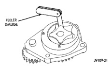
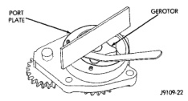
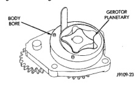
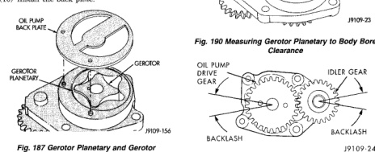

# 5.9L 24-VALVE TURBO DIESEL ENGINE 9-69

## REMOVAL AND INSTALLATION (Continued)

### CLEANING

Clean all parts in solvent and dry with compressed air. Clean the old sealer residue from the back of the gear housing cover and front of the gear housing.

### INSPECTION

Disassemble and inspect the oil pump as follows:

(1) Visually inspect the lube pump gears for chips, cracks or excessive wear.

(2) Remove the back plate (Fig. 187).

(3) Mark TOP on the gerotor planetary using a felt tip pen (Fig. 187).

(4) Remove the gerotor planetary (Fig. 187). Inspect for excessive wear or damage. Inspect the pump housing and gerotor drive for damaged and excessive wear.

(5) Install the gerotor planetary in the original position. The chamfer must be on the O.D. and down.

(6) Measure the tip clearance (Fig. 188). Maximum clearance is 0.1778 mm (0.007 inch). If the oil pump is out of limits, replace the pump.

(7) Measure the clearance of the gerotor drive/gerotor planetary to port plate (Fig. 189). Maximum clearance is 0.127 mm (0.005 inch). If the oil pump is out of limits, replace the pump.

(8) Measure the clearance of the gerotor planetary to the body bore (Fig. 190). Maximum clearance is 0.381 mm (0.015 inch). If the oil pump is out of limits, replace the pump.

(9) Measure the gears backlash (Fig. 191). The limits of a used pump is 0.080-0.380 mm (0.003-0.015 inch). If the backlash is out of limits, replace the oil pump.

(10) Install the back plate.

*Fig. 187 Gerotor Planetary and Gerotor]*
- OIL PUMP BACK PLATE
- GEROTOR PLANETARY
- GEROTOR

*Fig. 188 Measuring Tip Clearance]*
- FEELER GAUGE

*Fig. 189 Measuring Gerotor to Port Plate Clearance]*
- PORT PLATE
- GEROTOR

*Fig. 190 Measuring Gerotor Planetary to Body Bore Clearance]*
- BODY BORE
- GEROTOR PLANETARY

[Figure: Fig. 191 Measure Gear Backlash]
- OIL PUMP DRIVE GEAR
- IDLER GEAR
- BACKLASH

### INSTALLATION

(1) Lubricate the pump with clean engine oil. Filling the pump with clean engine oil during installation will help to prime the pump at engine start up.

(2) Verify the idler gear pin is installed in the locating bore in the cylinder block.