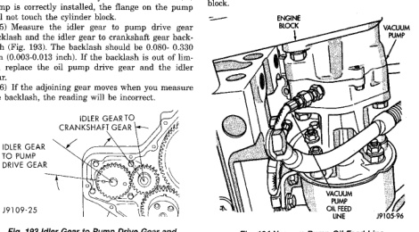
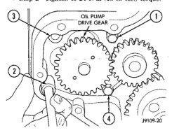

# 9-70 5.9L 24-VALVE TURBO DIESEL ENGINE

## REMOVAL AND INSTALLATION (Continued)

(3) Install the pump (Fig. 186). Tighten the oil pump mounting bolts in two steps, in the sequence shown in (Fig. 192).

- Step 1—Tighten to 5 N·m (44 in. lbs.) torque.
- Step 2—Tighten to 24 N·m (18 ft. lbs.) torque.

*Fig. 192 Oil Pump Bolt Torque Sequence]*
- OIL PUMP DRIVE GEAR
- 1, 2, 3, 4 (numbered positions)

(4) The back plate on the pump seats against the bottom of the bore in the cylinder block. When the pump is correctly installed, the flange on the pump will not touch the cylinder block.

(5) Measure the idler gear to pump drive gear backlash and the idler gear to crankshaft gear backlash (Fig. 193). The backlash should be 0.080-0.330 mm (0.003-0.013 inch). If the backlash is out of limits, replace the oil pump drive gear and the idler gear.

(6) If the adjoining gear moves when you measure the backlash, the reading will be incorrect.

*Fig. 186 Idler Gear to Pump Drive Gear and Crankshaft Gear Backlash]*
- IDLER GEAR TO CRANKSHAFT GEAR
- IDLER GEAR TO PUMP DRIVE GEAR

(7) Apply a bead of Mopar® Silicone Rubber Adhesive Sealant or equivalent to the gear housing cover sealing surface.

(8) Install the gear housing cover and tighten to 24 N·m (18 ft. lbs.) torque.

(9) Install the vibration damper and torque the bolts to 125 N·m (92 ft. lbs.). Use the engine barring tool to keep the engine from rotating during tightening operation.

(10) Install the fan support/hub assembly and torque bolts to 24 N·m (18 ft. lbs.).

(11) Install the accessory drive belt. Refer to Group 7, Cooling for the correct procedure.

(12) Connect battery negative cables.

(13) Start engine and check for oil leaks.

## VACUUM PUMP

### REMOVAL

(1) Disconnect battery negative cables.

(2) Position drain pan under power steering pump.

(3) Disconnect vacuum and steering pump hoses.

(4) Disconnect lubricating oil feed line from fitting at underside of vacuum pump (Fig. 194).

(5) Remove lower bolt that attaches pump assembly to engine block (Fig. 195).

(6) Remove bottom, inboard nut that attaches adapter to steering pump. This nut secures a small bracket to engine block. Nut and bracket must be removed before pump assembly can be removed from block.

[Figure: Fig. 194 Vacuum Pump Oil Feed Line]
- ENGINE BLOCK
- VACUUM PUMP
- VACUUM PUMP FEED LINE

(7) Remove upper bolt that attaches pump assembly to engine block (Fig. 196).

(8) Remove pump assembly from vehicle.

(9) Remove nuts attaching vacuum pump to adapter (Fig. 197).