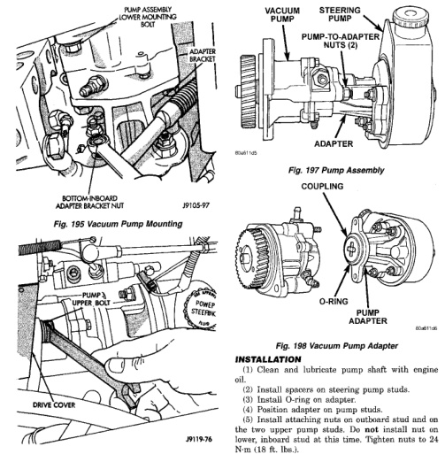

# BR — 5.9L 24-VALVE TURBO DIESEL ENGINE 9-71

## REMOVAL AND INSTALLATION (Continued)

*Fig. 198 Vacuum Pump Mounting]*
- PUMP ASSEMBLY COVER MOUNTING BOLT
- ADAPTER BRACKET
- UPPER BOLT
- BOTTOM INBOARD PUMP BRACKET NUT
- DRIVE COVER

[Figure: Fig. 196 Pump Assembly Upper Mounting Bolt]

[Figure: Fig. 197 Pump Assembly]
- VACUUM PUMP
- STEERING PUMP
- PUMP-TO-ADAPTER (2)
- ADAPTER

[Figure: Fig. 198 Vacuum Pump Adapter]
- COUPLING
- POWER STEERING PUMP
- O-RING
- PUMP ADAPTER

### INSTALLATION

(1) Clean and lubricate pump shaft with engine oil.

(2) Install spacers on steering pump studs.

(3) Install O-ring on adapter.

(4) Position adapter on pump studs.

(5) Install attaching nuts on outboard stud and on the two upper pump studs. Do not install nut on lower, inboard stud at this time. Tighten nuts to 24 N·m (18 ft. lbs.).

(6) Install coupling on pump shaft. Be sure coupling is securely engaged in shaft drive tangs.

(7) Install vacuum pump on adapter. Rotate drive gear until tangs on pump shaft engage in coupling. Verify that pump is seated before installing attaching nuts.

(8) Install and tighten vacuum pump attaching nuts.

(9) Inspect adapter O-ring and replace O-ring if cut or torn.

(10) Lubricate adapter O-ring with engine oil.

(10) Remove vacuum pump from adapter (Fig. 198). Turn pump gear back and forth to disengage pump shaft from coupling.

(11) Remove coupling from adapter (Fig. 199).

(12) Remove remaining adapter attaching nuts and remove adapter from steering pump (Fig. 200). If steering pump will be serviced, remove spacer from each inboard mounting stud on pump.