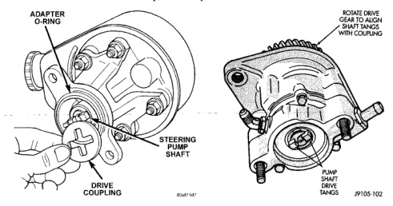
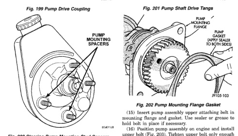

# 9-72 — 5.9L 24-VALVE TURBO DIESEL ENGINE — BR

## REMOVAL AND INSTALLATION (Continued)

*Fig. 199 Pump Drive Coupling]*
- ADAPTER O-RING
- STEERING PUMP SHAFT
- DRIVE COUPLING

*Fig. 201 Steering Pump Mounting Stud Spacers]*
- PUMP MOUNTING SPACERS

[Figure: Fig. 201 Pump Shaft Drive Tangs]
- ROTATE DRIVE GEAR TO ALIGN PUMP SHAFT WITH COUPLING
- PUMP SHAFT DRIVE TANGS

[Figure: Fig. 202 Pump Mounting Flange Gasket]
- PUMP MOUNTING FLANGE
- PUMP (WITH SEALER IN BOTH SIDES)

(11) Note position of drive slots in coupling (Fig. 201). Then rotate drive gear to align tangs on vacuum pump shaft with coupling.

(12) Verify that pump is seated in adapter and coupling.

(13) Install and tighten pump attaching nuts and washers.

(14) Position new gasket on vacuum pump mounting flange (Fig. 202). Use Mopar Perfect Seal, or silicone adhesive/sealer to hold gasket in place.

(15) Insert pump assembly upper attaching bolt in mounting flange and gasket. Use sealer or grease to hold bolt in place if necessary.

(16) Position pump assembly on engine and install upper bolt (Fig. 203). Tighten upper bolt only enough to hold assembly in place at this time.

(17) Working from under vehicle, install pump assembly lower attaching bolt. Then tighten upper and lower bolt to 77 N·m (57 ft. lbs.).

(18) Position bracket on steering pump inboard stud. Then install remaining adapter attaching nut on stud. Tighten nut to 24 N·m (18 ft. lbs.).

(19) Connect oil feed line to vacuum pump connector and tighten line fitting.