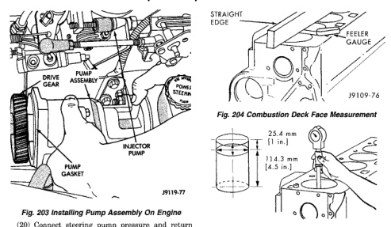

# 5.9L 24-VALVE TURBO DIESEL ENGINE 9-73

## REMOVAL AND INSTALLATION (Continued)

*Fig. 204 Installing Pump Assembly On Engine]*
- DRIVE PULLEY
- PUMP ASSEMBLY
- INJECTOR PUMP
- PUMP GASKET
- J9119-77

(20) Connect steering pump pressure and return lines to pump. Tighten pressure line fitting to 30 N·m (22 ft. lbs.).

(21) Connect vacuum hose to vacuum pump.

(22) Connect battery cables, if removed.

(23) Fill power steering pump reservoir.

(24) Purge air from steering pump lines. Start engine and slowly turn steering wheel left and right to circulate fluid and purge air from system.

(25) Stop engine and top off power steering reservoir fluid level.

(26) Start engine and verify that steering action is correct. Do this before moving vehicle.

## CLEANING AND INSPECTION

### CYLINDER BLOCK

#### INSPECTION

Measure the combustion deck face using a straight edge and a feeler gauge (Fig. 204). The distortion of the combustion deck face is not to exceed 0.010 mm (0.0004 inch) in any 50.00 mm (2.0 inch) diameter. Overall variation end to end or side to side is 0.075 mm (0.003 inch).

If the surface exceeds the limit, refer to Cylinder Block Refacing.

Inspect the cylinder bores for damage or excessive wear.

Measure the cylinder bores (Fig. 205). If the cylinder bores exceeds the limit, refer to Cylinder Bore Repair.

[Figure: Fig. 204 Combustion Deck Face Measurement]
- STRAIGHT EDGE
- FEELER GAUGE
- J9109-76

[Figure: Fig. 205 Cylinder Bore Diameter]
- 25.4 mm (1 in.)
- 114.3 mm (4.5 in.)
- J9119-77

| Specification | MIN. | MAX. |
|---|---|---|
| Diameter | 102.0 mm (4.0157 inch) | 102.116 mm (4.0203 inch) |
| Out-of-Round | 0.038 mm (0.0015 inch) | |
| Taper | 0.076 mm (0.003 inch) | |

Oversize pistons and rings are available for bored cylinder blocks.

J9209-167

Inspect the camshaft bores for scoring or excessive wear.

Measure the camshaft bores. Refer to engine specifications at the rear of this section. Limit for the No.1 bore applies to the ID of the bushing.

If a bore exceeds the limit, refer to Camshaft Bore Repair.

Inspect the tappet bores for scoring or excessive wear (Fig. 206). If out of limits, replace the cylinder block.

### CYLINDER HEAD

#### INSPECTION

Remove the cup plugs and inspect the coolant passages. A large build up of rust and lime will require removal of the cylinder block for cleaning in a hot tank.

Inspect the cylinder bores for damage or excessive wear. Rotate the crankshaft so the piston is at Bottom Dead Center (BDC) to inspect the bores.