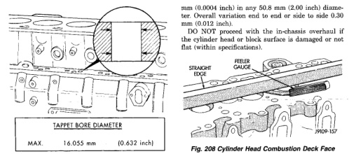

# 9-74 5.9L 24-VALVE TURBO DIESEL ENGINE

## CLEANING AND INSPECTION (Continued)

*Fig. 207 Tappet Bore Diameter]*
- TAPPET BORE DIAMETER
- J9109-79

| Specification | Value |
|---|---|
| MAX | 16.055 mm (0.632 inch) |

Measure the cylinder bores (Fig. 207). DO NOT proceed with in-chassis repair if the bores are damaged or worn beyond the limits (refer to Cylinder Bore Repair - Cylinder Block).

[Figure: Fig. 207 Cylinder Bore Diameter]
- 25.4 mm (1 in.)
- 144.3 mm (4.5 in.)
- REFERENCE HEIGHT (MIN.)

| Specification | MIN. | MAX. |
|---|---|---|
| Diameter | 102.0 mm (4.0157 inch) | 102.116 mm (4.0203 inch) |
| Out-of-Round | 0.038 mm (0.0015 inch) | |
| Taper | 0.076 mm (0.003 inch) | |

Oversize pistons and rings are available for bored cylinder blocks.

J9109-75

Check the top surface for damage caused by the cylinder head gasket leaking between cylinders. Inspect the block and head surface for nicks, erosion, etc.

Check the head distortion (Fig. 208). The distortion of the combustion deck face is not to exceed 0.010 mm (0.0004 inch) in any 50.8 mm (2.00 inch) diameter. Overall variation end to end or side to side is 0.90 mm (0.035 inch).

DO NOT proceed with the in-chassis overhaul if the cylinder head or block surface is damaged or not flat (within specifications).

[Figure: Fig. 208 Cylinder Head Combustion Deck Face Measurement]
- STRAIGHT EDGE
- FEELER GAUGE
- J9109-80

### REFACING HEAD SURFACE

The cylinder head combustion deck may be refaced in whatever increments necessary to clean up the surface and maintain the surface finish and flatness tolerances. The combined total of stock removed must not exceed 1.00 mm (0.03937 inch). The amount of stock removed each time must be steel stamped above combustion deck edge, on the lower right hand corner of the rear face (Fig. 209). Check valve protrusion after head surface refacing.

Surface finish requirements are 1.5-3.2 micrometers (60-126 microinch).

[Figure: Fig. 209 Cylinder Head Stock Removal]
- STOCK TOTAL (MAX)
- STOCK REMOVED SURFACE FINISH
- STOCK TOTAL (MAX) REMOVED FROM ORIGINAL REFERENCE HEIGHT (MIN.) 94.00 ± 0.25 mm (3.70 ± 0.01 inch)
- SURFACE FINISH 1.5 to 3.2 micrometers (60 to 126 microinch)
- J9-00-134