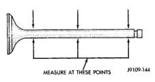

## CLEANING AND INSPECTION (Continued)

### CLEANING

Clean the carbon from the injector nozzle seat with a nylon or brass brush.

Scrape the gasket residue from all gasket surfaces. Wash the cylinder head in hot soapy water solution (88°C or 140°F).

After rinsing, use compressed air to dry the cylinder head.

Polish the gasket surface with 400 grit paper. Use an orbital sander or sanding block to maintain a flat surface.

### VALVES AND VALVE SPRINGS

#### CLEANING

Clean the valve stems with crocus cloth or a Scotch-Brite™ pad. Remove carbon with a soft wire brush. Clean valves, springs, retainers, and collets in a suitable solvent. Rinse in hot water and blow dry with compressed air.

#### INSPECTION

Visually inspect the valves for abnormal wear on the heads, stems, and tips. Replace any valve that is worn out or bent (Fig. 210).

Measure the valve stem diameter in three places as shown in (Fig. 211).

Measure the cylinder head valve guide bore (Fig. 212). Subtract the corresponding valve stem diameter to obtain valve stem-to-guide clearance.

Measure valve margin (rim thickness) (Fig. 213).

Measure the valve spring free length and maximum inclination (Fig. 214).

Test valve spring force with tool C-647 (Fig. 215).

*Fig. 211 Visually Inspect Valves for Abnormal Wear]*

*Fig. 212 Measure Valve Stem Diameter*

**VALVE STEM DIAMETER**

| Specification | Value |
|---|---|
| Minimum | 6.990 mm (0.2752 in.) |
| Maximum | 7.010 mm (0.2760 in.) |

[Figure: Fig. 212 Measure Valve Guide Bore]

[Figure: Fig. 213 Measure Valve Margin (Rim Thickness)
- VALVE RIM THICKNESS]

**VALVE MARGIN (RIM THICKNESS)**

0.72 mm (0.031 in.) MIN.

### CRANKSHAFT

#### CLEANING AND INSPECTION

Clean the crankshaft oil galley holes with a nylon brush.