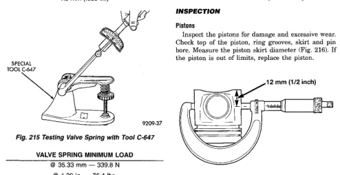

## CLEANING AND INSPECTION (Continued)

*Fig. 214 Measure Valve Spring Free Length and Max. Inclination*

**VALVE SPRING FREE LENGTH**

47.75 mm (1.88 in.)

**MAX INCLINATION**

1.5 mm (.059 in.)

*Fig. 215 Testing Valve Spring with Tool C-647]*

**VALVE SPRING MINIMUM LOAD**

| Compressed Length | Load |
|---|---|
| @ 35.33 mm | 339.8 N |
| @ 1.39 in. | 76.4 lbs. |

Rinse in clean solvent and dry with compressed air. Inspect the front and rear seal contact areas of the crankshaft for scratches or grooving.

The service seal kit will position the seal slightly deeper into the seal bore so it will contact the crankshaft at a different location. If this has already been done and the crankshaft has two worn areas, install a wear sleeve to provide a new contact surface for the seal.

Inspect the rod and main journal for deep scores, signs of overheating and other abnormal marks.

### PISTON AND CONNECTING ROD ASSEMBLY

#### CLEANING

**Pistons**

**CAUTION: DO NOT use bead blast to clean the pistons. DO NOT clean the pistons and rods in an acid tank.**

Clean the pistons and pins in a suitable solvent, rinse in hot water and blow dry with compressed air. Soaking the pistons over night will loosen most of the carbon build up. De-carbon the ring grooves with a broken piston ring and again clean the pistons in solvent. Rinse in hot water and blow dry with compressed air.

**Connecting Rods**

Clean the connecting rods in a suitable solvent, rinse in hot water and blow dry with compressed air.

#### INSPECTION

**Pistons**

Inspect the pistons for damage and excessive wear. Check top of the piston, ring grooves, skirt and pin bore. Measure the piston skirt diameter (Fig. 216). If the piston is out of limits, replace the piston.

[Figure: Fig. 216 Piston Skirt Diameter
- 12 mm (1/2 inch)]

**PISTON SKIRT DIAMETER (MIN.)**

101.864 mm (4.0104 in.)