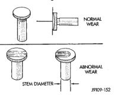

# CLEANING AND INSPECTION (Continued)

*Fig. 222 Measuring Camshaft Main Journals and Lobes*

| Camshaft Journal Diameter |
|---|
| Journal #1 54.609 mm (2.1279 in.) MIN. |
| Journal #2-7 53.987 mm (2.1245 in.) MIN. |

| Camshaft Lobe Height |
|---|
| Intake Lobe 47.173 mm (1.857 in.) MIN. |
| Exhaust Lobe 45.636 mm (1.796 in.) MIN. |

## CAMSHAFT GEAR

### INSPECTION

Visually inspect the camshaft gear for cracks (hub and gear), chipped or broken teeth, or excessive fretting (Fig. 222)(Fig. 223). Inspect and replace the keyway, if damaged.

*Fig. 223 Inspecting Camshaft Gear Hub for Cracks]*

[Figure: Fig. 223 Inspecting Camshaft Gear for Cracks and Fretting]

## TAPPETS

### CLEANING

Clean tappet with a suitable solvent. Rinse in hot water and blow dry with a clean shop rag or compressed air.

### INSPECTION

(1) Visually inspect the tappet socket, stem, and face for excessive wear, cracks, or obvious damage (Fig. 224).

(2) Measure the tappet stem diameter. Replace the tappet if it falls below the minimum size (Fig. 224).

[Figure: Fig. 224 Tappet Inspection
- NORMAL WEAR
- ABNORMAL WEAR
- STEM DIAMETER]

| TAPPET STEM DIAMETER |
|---|
| 15.925 mm (0.627 in.) MIN. |