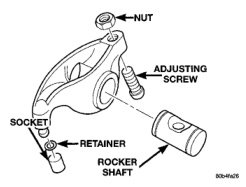
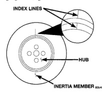
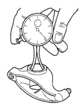
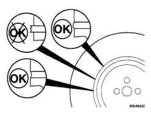

# 5.9L 24-VALVE TURBO DIESEL ENGINE 9-79

## CLEANING AND INSPECTION (Continued)

### CRANKSHAFT DAMPER

#### INSPECTION

(1) Inspect the damper hub for cracks and replace if any are found.

(2) Inspect the index lines on the damper hub and the inertia member (Fig. 225). If the lines are more than 1.59 mm (1/16 in.) out of alignment, replace the damper.

(3) Inspect the rubber member for deterioration or missing segments (Fig. 226).

*Fig. 225 Inspect Index Lines for Alignment]*
- INDEX LINES
- HUB
- INERTIA MEMBER

*Fig. 226 Inspect Damper Rubber Member]*
- Shows OK and X markings indicating acceptable and unacceptable conditions

### ROCKER ARM AND SHAFT

#### CLEANING

Disassemble and clean the rocker arm(s) (Fig. 227) in a suitable solvent. Rinse in hot water and blow dry with compressed air. If necessary, use a wire brush or wheel to remove stubborn deposits. Inspect oil passages in rocker arms and pedestals. Apply compressed air to oil orifices to purge contaminants.

*Fig. 227 Rocker Arm Assembly]*
- NUT
- ADJUSTING SCREW
- SOCKET
- RETAINER
- ROCKER SHAFT

#### INSPECTION

(1) Remove rocker shaft and inspect for cracks and excessive wear in the bore or shaft. Remove socket and inspect ball insert and socket for signs of wear. Replace retainer if necessary.

(2) Measure the rocker arm bore and shaft (Fig. 228)(Fig. 229).

*Fig. 228 Measuring Rocker Arm Bore]*

| ROCKER ARM BORE (MAX.) |
|------------------------|
| 22.027 mm (.867 in.) |

### PUSHRODS

#### CLEANING

Clean the push rods in a suitable solvent. Rinse in hot water and blow dry with compressed air. If necessary, use a wire brush or wheel to remove stubborn deposits.