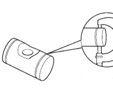
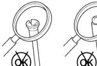

# 9-80 5.9L 24-VALVE TURBO DIESEL ENGINE

## CLEANING AND INSPECTION (Continued)

*Fig. 229 Measuring Rocker Arm Shaft]*

| ROCKER ARM SHAFT (MIN.) |
|-------------------------|
| 21.965 mm (.865 in.) |

#### INSPECTION

Inspect the push rod ball and socket for signs of scoring. Check for cracks where the ball and the socket are pressed into the tube (Fig. 230).

Roll the push rod on a flat work surface with the socket end hanging off the edge (Fig. 231). Replace any push rod that appears to be bent.

*Fig. 230 Inspecting Push Rod for Cracks]*
- Shows OK and X markings indicating acceptable and unacceptable conditions

[Figure: Fig. 231 Inspecting Push Rod for Flatness]
- Shows OK and X markings indicating acceptable and unacceptable conditions

#### INSPECTION

Inspect the crossheads for cracks and/or excessive wear on rocker lever and valve tip mating surfaces (Fig. 232). Replace any crossheads that exhibit abnormal wear or cracks.

[Figure: Fig. 232 Inspecting Crosshead for Cracks]
- Shows OK and X markings indicating acceptable and unacceptable conditions

### CROSSHEADS

#### CLEANING

Clean all crossheads in a suitable solvent. If necessary, use a wire brush or wheel to remove stubborn deposits. Rinse in hot water and blow dry with compressed air.

### OIL COOLER ELEMENT AND GASKET

#### CLEANING AND INSPECTION

Clean the sealing surfaces. Apply 483 kPa (70 psi) air pressure to the element to check for leaks. If the element leaks, replace the element.

### OIL PRESSURE REGULATOR VALVE AND SPRING

#### CLEANING

(1) Clean the regulator spring and plunger (Fig. 233) with a suitable solvent and blow dry with compressed air. If the plunger bore requires cleaning, it is necessary to remove the oil filter head to avoid getting debris into the engine.