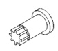
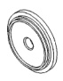
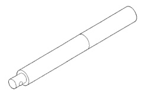
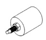

# 5.9L 24-VALVE TURBO DIESEL ENGINE 9-85

## SPECIFICATIONS (Continued)

| DESCRIPTION | TORQUE |
|-------------|--------|
| Torque Converter Drive Plate Bolts | 47 N·m (35 ft. lbs.) |
| Transfer Case-to-Insulator Mounting Plate Nuts | 204 N·m (150 ft. lbs.) |
| Transmission Support Bracket - (2wd) Bolts | 68 N·m (50 ft. lbs.) |
| Transmission Support Spacer - (4wd) Bolts | 68 N·m (50 ft. lbs.) |
| Transmission Support Spacer-to-Insulator Mounting Plate - (4wd) Bolts | 204 N·m (150 ft. lbs.) |
| Turbocharger/CAC System Clamp(s) (All) Nut | 8 N·m (71 in. lbs.) |
| Turbocharger Oil Supply Line Nut | 20 N·m (15 ft. lbs.) |
| Turbocharger Oil Drain Pipe Bolts | 27 N·m (20 ft. lbs.) |
| Turbocharger-to-Exhaust Manifold Nuts | 45 N·m (33 ft. lbs.) |
| Vacuum Pump-to-adapter Nuts | 24 N·m (18 ft. lbs.) |
| Vacuum Pump adapter-to-PS Pump Nuts | 24 N·m (18 ft. lbs.) |
| Vacuum Pump-to-Gear Housing Bolts | 77 N·m (57 ft. lbs.) |
| Vacuum Pump Oil Supply Line Fitting | 10 N·m (89 in. lbs.) |
| Water Pump Bolts | 24 N·m (18 ft. lbs.) |
| Water In Fuel Sensor Sensor | 3 N·m (30 in. lbs.) |

## SPECIAL TOOLS

### 5.9L DIESEL ENGINE

*Fig. 239 Universal Driver Handle—C 4171]*

*Fig. 2 Crankshaft Barring Tool—7471B*

*Fig. 3 Crankshaft Front Oil Seal Installer—8281*

*Fig. 4 Injector Removal Tool—8318*