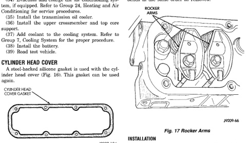

# 9-32 3.9L ENGINE BR

## REMOVAL AND INSTALLATION (Continued)

(24) Install the generator and wire connections. Refer to Group 8B, Battery/Starter/Generator Service.

(25) Install radiator. Refer to Group 7, Cooling System.

(26) Connect the lower radiator hose.

(27) Install the fan shroud.

(28) Install the fan.

(29) Connect the top radiator hose.

(30) Install the washer bottle.

(31) If equipped, install the condenser.

(32) Install the A/C compressor with the lines attached.

(33) Install the serpentine belt. Refer to Group 7, Cooling System.

(34) Evacuate and charge the air conditioning system, if equipped. Refer to Group 24, Heating and Air Conditioning for service procedures.

(35) Install the transmission oil cooler.

(36) Install the upper crossmember and top core support.

(37) Add coolant to the cooling system. Refer to Group 7, Cooling System for the proper procedure.

(38) Install the battery.

(39) Road test vehicle.

## CYLINDER HEAD COVER

A fiber backed silicone gasket is used with the cylinder head cover (Fig. 16). This gasket can be used again.

*Fig. 17 Cylinder Head Cover Gasket]*

### REMOVAL

(1) Disconnect the negative cable from the battery.

(2) Disconnect closed ventilation system and evaporation control system from cylinder head cover.

(3) Remove cylinder head cover and gasket. The gasket may be used again.

### INSTALLATION

(1) Install the cylinder head cover gasket onto the head rail.

(2) Position the cylinder head cover onto the gasket. Tighten the bolts to 11 N·m (95 in. lbs.) torque.

(3) Install closed crankcase ventilation system and evaporation control system.

(4) Connect the negative cable to the battery.

## CYLINDER HEAD COMPONENT SERVICE

### ROCKER ARMS AND PUSH RODS

#### REMOVAL

(1) Disconnect spark plug wires by pulling on the boot straight out in line with plug.

(2) Remove cylinder head cover and gasket.

(3) Remove the rocker arm bolts and pivots (Fig. 17). Place them on a bench in the same order as removed.

(4) Remove the push rods and place them on a bench in the same order as removed.

[Figure: Fig. 17 Rocker Arms]

#### INSTALLATION

(1) Rotate the crankshaft until the V6 mark lines up with the TDC mark on the timing chain case cover. This mark is located 147° ATDC from the No. 1 firing position.

**CAUTION: DO NOT rotate or crank the engine during or immediately after rocker arm installation. Allow the hydraulic roller tappets adequate time to bleed down (about 5 minutes).**

(2) Install the push rods in the same order as removed.

(3) Install rocker arm and pivot assemblies in the same order as removed. Tighten the rocker arm bolts to 28 N·m (21 ft. lbs.) torque.

(4) Install cylinder head cover.