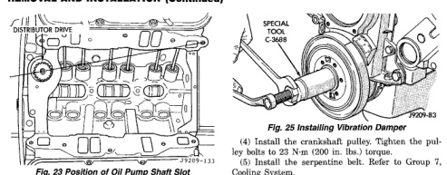

# 3.9L ENGINE

## REMOVAL AND INSTALLATION (Continued)

*Fig. 24 Position of Oil Pump Shaft Slot]*

tion timing. Adjusting distributor position will affect fuel synchronization only.

## VIBRATION DAMPER

### REMOVAL

(1) Disconnect the negative cable from the battery.

(2) Remove fan shroud retainer bolts and set shroud back over engine.

(3) Remove the cooling system fan.

(4) Remove the serpentine belt. Refer to Group 7, Cooling System.

(5) Remove the vibration damper pulley.

(6) Remove vibration damper bolt and washer from end of crankshaft.

(7) Install bar and screw from Puller Tool Set C-3688. Install two bolts with washers through the puller tool and into the vibration damper (Fig. 24).

*Fig. 25 Vibration Damper Assembly*

(8) Pull vibration damper off of the crankshaft.

### INSTALLATION

(1) Position the vibration damper onto the crankshaft.

(2) Place installing tool, part of Puller Tool Set C-3688, in position and press the vibration damper onto the crankshaft (Fig. 25).

(3) Install the crankshaft bolt and washer. Tighten the bolt to 183 N·m (135 ft. lbs.) torque.

[Figure: Fig. 25 Installing Vibration Damper
- Special Tool C-3688
- 7599-43]

(4) Install the crankshaft pulley. Tighten the pulley bolts to 23 N·m (200 in. lbs.) torque.

(5) Install the serpentine belt. Refer to Group 7, Cooling System.

(6) Install the cooling system fan. Tighten the bolts to 23 N·m (17 ft. lbs.) torque.

(7) Position the fan shroud and install the bolts. Tighten the retainer bolts to 11 N·m (95 in. lbs.) torque.

(8) Connect the negative cable to the battery.

## TIMING CHAIN COVER

### REMOVAL

(1) Disconnect the battery negative cable.

(2) Drain cooling system. Refer to Group 7, Cooling System.

(3) Remove the serpentine belt. Refer to Group 7, Cooling System.

(4) Remove water pump. Refer to Group 7, Cooling System.

(5) Remove power steering pump. Refer to Group 19, Steering.

(6) Remove vibration damper.

(7) Loosen oil pan bolts and remove the front bolt at each side.

(8) Remove the cover bolts.

(9) Remove chain case cover and gasket using extreme caution to avoid damaging oil pan gasket.

(10) From the inside of the cover tap the front crankshaft oil seal outward. Be careful not to damage the timing cover sealing surface.

### INSTALLATION

(1) Be sure mating surfaces of chain case cover and cylinder block are clean and free from burrs.

(2) Using a new cover gasket, carefully install chain case cover to avoid damaging oil pan gasket. Use a small amount of Mopar Silicone Rubber Adhesive Sealant, or equivalent, at the joint between timing chain cover gasket and the oil pan gasket. Finger tighten the timing chain cover bolts at this time.

**CAUTION:** If chain cover is replaced for any reason, be sure the oil hole (passenger side of cover) is plugged.