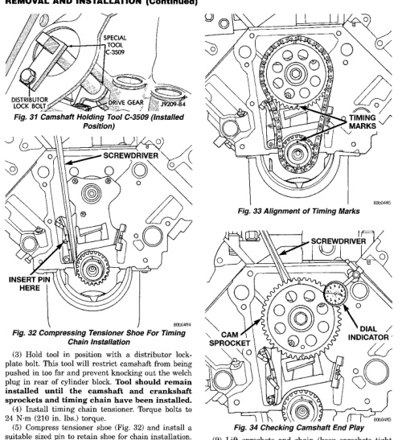

# 3.9L ENGINE - REMOVAL AND INSTALLATION (Continued)

*Fig. 32 Camshaft Holding Tool C-3509 (Installed Position)]*
- Special Tool C-3509
- Distributor Lock Bolt
- Drive Gear

[Figure: Fig. 32 Compressing Tensioner Shoe For Timing Chain Installation]
- Screwdriver
- Insert Here

[Figure: Fig. 33 Alignment of Timing Marks]
- Timing Marks
- Screwdriver
- Cam Sprocket
- Dial Indicator

[Figure: Fig. 34 Checking Camshaft End Play]

(3) Hold tool in position with a distributor lockplate bolt. This tool will restrict camshaft from being pushed in too far and prevent knocking out the welch plug in rear of cylinder block. Tool should remain installed until the camshaft and crankshaft sprockets and timing chain have been installed.

(4) Install timing chain tensioner. Torque bolts to 24 N·m (210 in. lbs.) torque.

(5) Compress tensioner shoe (Fig. 32) and install a suitable sized pin to retain shoe for chain installation.

(6) Place both camshaft sprocket and crankshaft sprocket on the bench with timing marks on an exact imaginary center line through both camshaft and crankshaft bores.

(7) Place timing chain around both sprockets.

(8) Turn crankshaft and camshaft to line up with keyway location in crankshaft sprocket and in camshaft sprocket.

(9) Lift sprockets and chain (keep sprockets tight against the chain in position as described).

(10) Slide both sprockets evenly over their respective shafts and use a straightedge to check alignment of timing marks (Fig. 33).

(11) Install the camshaft bolt/cup washer. Tighten bolt to 68 N·m (50 ft. lbs.) torque.

(12) Measure camshaft end play (Fig. 34). Refer to Specifications for proper clearance. If not within limits, install a new timing chain tensioner.