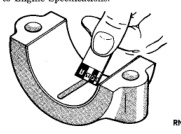
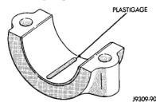

# GENERAL INFORMATION (Continued)

areas can be checked by placing the Plastigage in that area. Tighten the bearing cap bolts of the bearing being checked to 115 N·m (85 ft. lbs.) torque. DO NOT rotate the crankshaft or the Plastigage may be smeared, giving inaccurate results.

*Fig. 1 Plastigage placement diagram*

RN300-90

**Fig. 1 Placement of Plastigage in Bearing Shell**

(2) Remove the bearing cap and compare the width of the flattened Plastigage with the scale provided on the package (Fig. 2). Plastigage generally comes in two scales (one scale is in inches and the other is a metric scale). Locate the band closest to the same width. This band shows the amount of clearance. Differences in readings between the ends indicate the amount of taper present. Record all readings taken. Refer to Engine Specifications.

*Fig. 2 Clearance measurement diagram*

RN861

**Fig. 2 Clearance Measurement**

(3) Plastigage is available in a variety of clearance ranges. The 0.025-0.076 mm (0.001-0.003 in.) range is usually the most appropriate for checking engine bearing clearances.

## CONNECTING ROD BEARING CLEARANCE

Engine connecting rod bearing clearances can be determined by use of Plastigage, or equivalent. The following is the recommended procedure for the use of Plastigage:

(1) Remove oil film from surface to be checked. Plastigage is soluble in oil.

(2) Place a piece of Plastigage across the entire width of the bearing cap shell (Fig. 1). Position the Plastigage approximately 6.35 mm (1/4 inch) off center and away from the oil holes. In addition, suspect areas can be checked by placing the Plastigage in the suspect area.

(3) The crankshaft must be rotated until the connecting rod to be checked starts moving toward the top of the engine. Only then should the rod cap, with Plastigage in place, be assembled. Tighten the rod cap nut to 61 N·m (45 ft. lbs.) torque. DO NOT rotate the crankshaft or the Plastigage may be smeared, giving inaccurate results.

(4) Remove the bearing cap and compare the width of the flattened Plastigage with the scale provided on the package (Fig. 2). Plastigage generally comes in two scales (one scale is in inches and the other is a metric scale). Locate the band closest to the same width. This band shows the amount of clearance. Differences in readings between the ends indicate the amount of taper present. Record all readings taken. Refer to Engine Specifications.

(5) Plastigage is available in a variety of clearance ranges. The 0.025-0.076 mm (0.001-0.003 in.) range is usually the most appropriate for checking engine bearing clearances.

## ENGINE OIL SERVICE

**WARNING: NEW OR USED ENGINE OIL CAN BE IRRITATING TO THE SKIN. AVOID PROLONGED OR REPEATED SKIN CONTACT WITH ENGINE OIL. CONTAMINANTS IN USED ENGINE OIL, CAUSED BY INTERNAL COMBUSTION, CAN BE HAZARDOUS TO YOUR HEALTH. THOROUGHLY WASH EXPOSED SKIN WITH SOAP AND WATER. DO NOT WASH SKIN WITH GASOLINE, DIESEL FUEL, THINNER, OR SOLVENTS. HEALTH PROBLEMS CAN RESULT. DO NOT POLLUTE. DISPOSE OF USED ENGINE OIL PROPERLY.**

## ENGINE OIL SPECIFICATION

**CAUTION: Do not use non-detergent or straight mineral oil when adding or changing crankcase lubricant. Engine failure can result.**

### API SERVICE GRADE CERTIFIED

In gasoline engines, use an engine oil that is API Service Grade Certified (Fig. 3). In diesel engines, use an engine oil that conforms to API Service Grade CF-4 or CG-4/SH (Fig. 4). MOPAR provides engine oils that conform to all of these service grades.

Standard engine-oil identification notations have been adopted to aid in the proper selection of engine oil. The identifying notations are located on the label of engine oil plastic bottles and the top of engine oil cans.