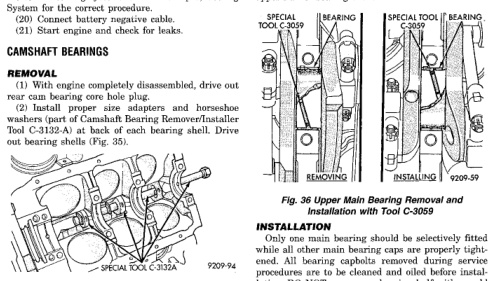

# 3.9L ENGINE - REMOVAL AND INSTALLATION (Continued)

(13) Each tappet reused must be installed in the same position at which it was removed. When camshaft is replaced, all of the tappets must be replaced.

(14) Install timing chain cover.

(15) Install intake manifold. Refer to Group 11, Exhaust System and Intake Manifold for the correct procedure.

(16) Install distributor. Refer to Group 8D, Ignition System for the correct procedure.

(17) Install cylinder head covers.

(18) Install radiator.

(19) Fill cooling system. Refer to Group 7, Cooling System for the correct procedure.

(20) Connect battery negative cable.

(21) Start engine and check for leaks.

## CAMSHAFT BEARINGS

### REMOVAL

(1) With engine completely disassembled, drive out rear cam bearing core hole plug.

(2) Using Camshaft Bearing Remover and Installer washers (part of Camshaft Bearing Remover/Installer Tool C-3132-A as back of each bearing shell. Drive out bearing shells (Fig. 35).

*Fig. 35 Camshaft Bearings Removal and Installation with Tool C-3132-A]*

### INSTALLATION

(1) Install new camshaft bearings with Camshaft Bearing Remover/Installer Tool C-3132-A by sliding the new camshaft bearing shell over proper adapter.

(2) Position rear bearing in the tool. Install horseshoe lock and, by reversing removal procedure, carefully drive bearing shell into place.

(3) Install remaining bearings in the same manner. Bearings must be carefully aligned to bring oil holes into full register with oil passages from the main bearing. If the camshaft bearing shell oil holes are not in exact alignment, remove and install them correctly. Install a new core hole plug at the rear of camshaft. Be sure this plug does not leak.

## CRANKSHAFT MAIN BEARINGS

### REMOVAL

(1) Remove the oil pan.

(2) Remove the oil pump from the rear main bearing cap.

(3) Identify bearing caps before removal. Remove bearing caps one at a time.

(4) Remove upper half of bearing by inserting Crankshaft Main Bearing Remover/Installer Tool C-3059 into the oil hole of crankshaft (Fig. 36).

(5) Slowly rotate crankshaft clockwise, forcing out upper half of bearing shell.

[Figure: Fig. 36 Upper Main Bearing Removal and Installation with Tool C-3059]
- Special Tool C-3059
- Bearing Cap
- Bearing Shell
- Removing
- Installing

### INSTALLATION

Only one main bearing should be selectively fitted while all other main bearing caps are properly tightened. All bearing capbolts removed during service procedures are to be cleaned and oiled before installation. DO NOT use a new bearing half with an old bearing half.

When installing a new upper bearing shell, slightly chamfer the sharp edges from the plain side.

(1) Start bearing in place, and insert Crankshaft Main Bearing Remover/Installer Tool C-3059 into oil hole of crankshaft (Fig. 36).

(2) Slowly rotate crankshaft counterclockwise sliding the bearing into position. Remove Tool C-3059.

(3) Install the bearing caps. Clean and oil the bolts. Tighten the capbolts to 115 N·m (85 ft. lbs.) torque.

(4) Install the oil pump.

(5) Install the oil pan.