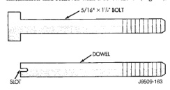
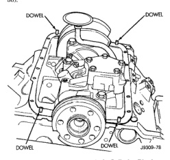

# 3.9L ENGINE 9-41

## REMOVAL AND INSTALLATION (Continued)

### OIL PAN

#### REMOVAL

(1) Disconnect the negative cable from the battery.
(2) Remove engine oil dipstick.
(3) Raise vehicle.
(4) Drain engine oil.
(5) Remove exhaust pipe.
(6) Remove left engine to transmission strut.
(7) Loosen the right side engine support bracket cushion through-bolt nut and raise the engine slightly. Remove oil pan by sliding backward and out.
(8) Remove the one-piece gasket.

#### INSTALLATION

(1) Clean the block and pan gasket surfaces.
(2) Fabricate four alignment dowels from 5/16 X 1 1/2 inch bolts. Cut the head off the bolts and cut a slot into the top of the dowel. This will allow easier installation and removal with a screwdriver (Fig. 37).

*Fig. 37 Fabrication of Alignment Dowels - Shows two diagrams of dowel and slot configurations, labeled "DOWEL" and "SLOT" with dimension "J9509-161"]*

(3) Install the dowels in the cylinder block (Fig. 38).

*Fig. 38 Position of Dowels in Cylinder Block - Shows engine block diagram with four dowel positions marked around the perimeter, labeled "J9509-78"]*

(4) Apply small amount of Mopar® Silicone Rubber Adhesive Sealant, or equivalent, in the corner of the cap and the cylinder block.
(5) Slide the one-piece gasket over the dowels and onto the block.
(6) Position the oil pan over the dowels and onto the gasket.
(7) Install the oil pan bolts. Tighten the bolts to 24 N·m (215 in. lbs.) torque.
(8) Remove the dowels. Install the remaining oil pan bolts. Tighten these bolts to 24 N·m (215 in. lbs.) torque.
(9) Lower the engine into the support cushion brackets and tighten the through-bolt nut to the proper torque.
(10) Install the drain plug. Tighten drain plug to 34 N·m (27 ft. lbs.) torque.
(11) Install the engine to transmission strut.
(12) Install exhaust pipe.
(13) Lower vehicle.
(14) Install dipstick.
(15) Connect the negative cable to the battery.
(16) Fill crankcase with oil to proper level.

### OIL PUMP

#### REMOVAL

(1) Remove the oil pan.
(2) Remove the oil pump from rear main bearing cap.

#### INSTALLATION

(1) Install oil pump. During installation, slowly rotate pump body to ensure driveshaft-to-pump rotor shaft engagement.
(2) Hold the oil pump base flush against mating surface on No. 4 main bearing cap. Finger-tighten pump attaching bolts. Tighten attaching bolts to 41 N·m (30 ft. lbs.) torque.
(3) Install the oil pan.

### PISTON AND CONNECTING ROD ASSEMBLY

#### REMOVAL

(1) Remove the engine from the vehicle.
(2) Remove the cylinder head.
(3) Remove the oil pan.
(4) Remove top ridge of cylinder bores with a reliable ridge reamer before removing pistons from cylinder block. Be sure to keep tops of pistons covered during this operation.
(5) Be sure each connecting rod and connecting rod cap is identified with the cylinder number. Remove connecting rod cap. Install connecting rod bolt guide set on connecting rod bolts.
(6) Pistons and connecting rods must be removed from top of cylinder block. When removing the