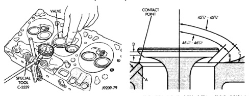

# DISASSEMBLY AND ASSEMBLY (Continued)

*Fig. 51 Measuring Valve Guide Wear - Shows valve guide measurement setup with special tool and reference number 9309-79]*

## VALVE GUIDES

Service valves with oversize stems are available (Fig. 52).

| Reamer O/S | Valve Guide Size |
|------------|------------------|
| 0.076 mm (0.003 in.) | 8.026 - 8.052 mm (0.316 - 0.317 in.) |
| 0.381 mm (0.015 in.) | 8.331 - 8.357 mm (0.328 - 0.329 in.) |

19309-30

**Fig. 52 Reamer Sizes**

(1) Slowly turn reamer by hand and clean guide thoroughly before installing new valve. Ream the valve guides from standard to 0.381 mm (0.015 in.). Use a two step procedure so the valve guides are reamed true in relation to the valve seat:

• Step 1—Ream to 0.0763 mm (0.003 inch).
• Step 2—Ream to 0.381 mm (0.015 inch).

## REFACING VALVES AND VALVE SEATS

The intake and exhaust valves have a 43-1/4° to 43-3/4° face angle and a 44-1/4° to 44-3/4° seat angle (Fig. 53).

### VALVES

Inspect the remaining margin after the valves are refaced (Fig. 54). Valves with less than 1.190 mm (0.047 in.) margin should be discarded.

### VALVE SEATS

**CAUTION: DO NOT un-shroud valves during valve seat refacing (Fig. 55).**

*Fig. 52 Valve Face and Seat Angles - Technical diagram showing:*

19309-95

[Figure: Fig. 54 Intake and Exhaust Valves - Shows cross-section with INTAKE VALVE, MARGIN, FACE, STEM, EXHAUST VALVE, and VALVE SPRING RETAINER GROOVE labeled]

29289-127

(1) When refacing valve seats, it is important that the correct size valve guide pilot be used for reseating stones. A true and complete surface must be obtained.

(2) Measure the concentricity of valve seat using a dial indicator. Total runout should not exceed 0.051 mm (0.002 in.) total indicator reading.

(3) Inspect the valve seat with Prussian blue, to determine where the valve contacts the seat. To do this, coat valve seat LIGHTLY with Prussian blue then set valve in place. Rotate the valve with light pressure. If the blue is transferred to the center of valve face, contact is satisfactory. If the blue is transferred to the top edge of valve face, lower valve seat