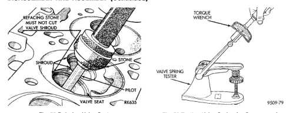
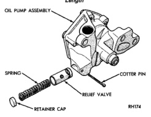

# DISASSEMBLY AND ASSEMBLY (Continued)

*Fig. 56 Refacing Valve Seats - Shows technical diagram with labels: REFACING STONE, SHROUD, VALVE SHROUD, STONE, PILOT, VALVE SEAT, BEAM]*

9309-79

with a 15° stone. If the blue is transferred to bottom edge of valve face raise valve seat with a 60° stone.

(4) When seat is properly positioned the width of intake seats should be 1.016-1.524 mm (0.040-0.060 in.). The width of the exhaust seats should be 1.524-2.032 mm (0.060-0.080 in.).

## VALVE SPRINGS

Whenever valves have been removed for inspection, reconditioning or replacement, valve springs should be tested. As an example the compression length of the spring to be tested is 1-5/16 in.. Turn table of Universal Valve Spring Tester Tool until surface is in line with the 1-5/16 in. mark on the threaded stud. Be sure the zero mark is to the front (Fig. 56). Place spring over stud on the table and lift compressing lever to set tone device. Pull on torque wrench until ping is heard. Take reading on torque wrench at this instant. Multiply this reading by 2. This will give the spring load at test length. Fractional measurements are indicated on the table for finer adjustments. Refer to specifications to obtain specified height and allowable tensions. Discard the springs that do not meet specifications.

*Fig. 57 Testing Valve Spring for Compressed Length - Shows VALVE SPRING TESTER and TORQUE WRENCH]*

9309-79

## OIL PUMP

### DISASSEMBLE

(1) Remove the relief valve as follows:

(a) Remove cotter pin. Drill a 3.175 mm (1/8 in.) hole into the relief valve retainer cap and insert a self-threading sheet metal screw into cap.

(b) Clamp screw into a vise and while supporting oil pump, remove cap by tapping pump body using a soft hammer. Discard retainer cap and remove spring and relief valve (Fig. 57).

(2) Remove oil pump cover (Fig. 58).

(3) Remove pump outer rotor and inner rotor with shaft (Fig. 58).

*Fig. 58 Oil Pressure Relief Valve - Shows OIL PUMP ASSEMBLY with labeled components:*

R0174

(4) Wash all parts in a suitable solvent and inspect carefully for damage or wear.

[Figure: Fig. 58 Oil Pump - Shows exploded view with labeled components:
- INNER ROTOR AND SHAFT
- DISTRIBUTOR DRIVESHAFT BODY (REFERENCE)
- OUTER ROTOR
- COTTER PIN
- RELIEF VALVE
- BOLT
- RETAINER CAP
- SPRING
- LARGE CHAMFERED EDGE]

R0108

### ASSEMBLE

(1) Install pump rotors and shaft, using new parts as required.