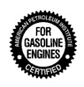
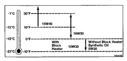
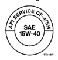

# GENERAL INFORMATION (Continued)

*Fig. 5 FOR GASOLINE ENGINES certification seal*

9400-9

**Fig. 3 API Service Grade Certification Label—Gasoline Engine Oil**

*Fig. 6 API SERVICE CERTIFICATION 15W-40 seal*

9400-8

**Fig. 4 API Service Grade Certification Label—Diesel Engine Oil**

### SAE VISCOSITY

An SAE viscosity grade is used to specify the viscosity of engine oil. SAE 10W-30 specifies a multiple viscosity engine oil.

When choosing an engine oil, consider the range of temperatures the vehicle will be operated in before the next oil change. Select an engine oil that is best suited to your area's particular ambient temperature range and variation. For gasoline engines, refer to (Fig. 5). For diesel engines, refer to (Fig. 6).

#### ENGINE OIL VISCOSITY GRADES

| SAE Grade | Temperature Range °F (°C) |
|-----------|---------------------------|
| 10W-30 | -20° to 100° (-29° to 38°) |
| 5W-30 | -30° to 100° (-34° to 38°) |
| 10W-40 | -10° to 100° (-23° to 38°) |

**Temperature range anticipated before next oil change**

**Fig. 5 Engine Oil Viscosity Recommendation—Gasoline Engines**

### ENERGY-CONSERVING OIL

An Energy Conserving type oil is recommended for gasoline engines. They are designated as either ENERGY CONSERVING or ENERGY CONSERVING II.

*Fig. 7 Temperature chart showing viscosity grades 10W-30, 5W-30, 10W-30, and 10W-40 with temperature ranges and block heater recommendations*

**Fig. 6 Engine Oil Viscosity Recommendation—Diesel Engines**

## CRANKCASE OIL LEVEL INSPECTION

**CAUTION: Do not overfill crankcase with engine oil, oil foaming and oil pressure loss can result.**

To ensure proper lubrication of an engine, the engine oil must be maintained at an acceptable level. The acceptable oil level is in the SAFE RANGE on the engine oil dipstick (Fig. 7).

Unless the engine has exhibited loss of oil pressure, run the engine for about five minutes before checking oil level. Checking engine oil level of a cold engine is not accurate.

*Fig. 8 Oil dipstick diagram showing:
• O-RING
• ADD OIL MARK
• SAFE RANGE*

9400-05

**Fig. 7 Oil Level Indicator (Dipstick)**

(1) Position vehicle on level surface.

(2) With engine OFF, allow approximately ten minutes for oil to settle to bottom of crankcase, remove engine oil dipstick.

(3) Wipe dipstick clean.

(4) Replace dipstick and verify it is seated in the tube.

(5) Remove dipstick, with handle held above the tip, take oil level reading.

(6) Add oil only if level is below the SAFE RANGE area on the dipstick.

(7) Replace dipstick.

## ENGINE OIL CHANGE

Change engine oil at mileage and time intervals described in the Maintenance Schedule.