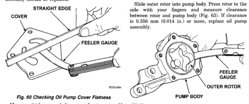
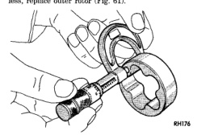

# 9-50 3.9L ENGINE

## CLEANING AND INSPECTION (Continued)

### OIL PUMP

#### OIL PUMP PRESSURE

The MINIMUM oil pump pressure is 41.4 kPa (6 psi) at curb idle. The NORMAL oil pump pressure is 207-552 kPa (30-80 psi) at 3,000 RPM or more.

**CAUTION: If oil pressure is ZERO at curb idle, DO NOT run engine.**

#### INSPECTION

Mating surface of the oil pump cover should be smooth. Replace pump assembly if cover is scratched or grooved.

Lay a straightedge across the pump cover surface (Fig. 60). If a 0.038 mm (0.0015 in.) feeler gauge can be inserted between cover and straightedge, pump assembly should be replaced.

*Fig. 60 Checking Oil Pump Cover Flatness*

Measure thickness and diameter of outer rotor. If outer rotor thickness measures 20.9 mm (0.825 in.) or less, or if the diameter is 62.7 mm (2.469 in.) or less, replace outer rotor (Fig. 61).

*Fig. 61 Measuring Outer Rotor Thickness]*

If inner rotor measures 20.9 mm (0.825 in.) or less, replace inner rotor and shaft assembly (Fig. 62).

*Fig. 62 Measuring Inner Rotor Thickness]*

Slide outer rotor into pump body. Press rotor to the side with your fingers and measure clearance between rotor and pump body (Fig. 63). If clearance is 0.356 mm (0.014 in.) or more, replace oil pump assembly.

[Figure: Fig. 63 Measuring Outer Rotor Clearance in Housing
- FEELER GAUGE
- OUTER ROTOR
- PUMP BODY]

Install inner rotor and shaft into pump body. If clearance between inner and outer rotors is 0.203 mm (0.008 in.) or more, replace shaft and both rotors (Fig. 64).

Place a straightedge across the face of the pump, between bolt holes. If a feeler gauge of 0.102 mm (0.004 in.) or more can be inserted between rotors and the straightedge, replace pump assembly (Fig. 65).

Inspect oil pressure relief valve plunger for scoring and free operation in its bore. Small marks may be removed with 400-grit wet or dry sandpaper.

The relief valve spring has a free length of approximately 49.5 mm (1.95 in.). The spring should test between 19.5 and 20.5 pounds when compressed to