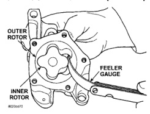
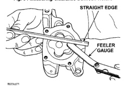
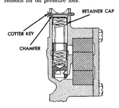

# CLEANING AND INSPECTION (Continued)

## OIL PAN

### CLEANING

Clean the block and pan gasket surfaces. Trim or remove excess sealant film in the rear main cap oil pan gasket groove. DO NOT remove the sealant inside the rear main cap slots.

If present, trim excess sealant from inside the engine.

Clean oil pan in solvent and wipe dry with a clean cloth.

Clean oil screen and pipe thoroughly in clean solvent. Inspect condition of screen.

### INSPECTION

Inspect oil drain plug and plug hole for stripped or damaged threads. Repair as necessary.

Inspect oil pan mounting flange for bends or distortion. Straighten flange, if necessary.

## CYLINDER BLOCK

### CLEANING

Clean cylinder block thoroughly and check all core hole plugs for evidence of leaking.

### INSPECTION

Examine block for cracks or fractures.

The cylinder walls should be checked for out-of-round and taper with Cylinder Bore Indicator Tool C-119. The cylinder block should be bored and honed with new pistons and rings fitted if:

• The cylinder bores show more than 0.127 mm (0.005 in.) out-of-round.
• The cylinder bores show a taper of more than 0.254 mm (0.010 in.).
• The cylinder walls are badly scuffed or scored.

Boring and honing operation should be closely coordinated with the fitting of pistons and rings, so that specified clearances can be maintained.

## OIL LINE PLUG

The oil line plug is located in the vertical passage at the rear of the block between the oil-to-filter and oil-from-filter passages (Fig. 67). Improper installation or plug missing could cause erratic, low, or no oil pressure.

The oil plug must come out the bottom. Use flat dowel, down the oil pressure sending unit hole from the top, to remove oil plug.

(1) Remove oil pressure sending unit from back of block.

(2) Insert a 3.175 mm (1/8 in.) finish wire, or equivalent, into passage.

(3) Plug should be 190.0 to 195.2 mm (7-1/2 to 7-11/16 in.) from machined surface of block (Fig. 67).

*Fig. 64 Measuring Clearance Between Rotors]*
• OUTER ROTOR
• FEELER GAUGE
• INNER ROTOR

*Fig. 66 Measuring Clearance Over Rotors]*
• STRAIGHT EDGE
• FEELER GAUGE

*Fig. 67 Proper Installation of Retainer Cap]*
• RETAINER CAP
• COVER
• CHAMFER