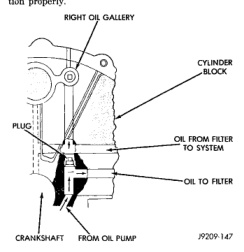

# CLEANING AND INSPECTION (Continued)

If plug is too high, use a suitable flat dowel to position properly.

*Fig. 1 Oil Line Plug]*
• RIGHT OIL GALLERY
• CYLINDER BLOCK
• PLUG
• OIL FROM FILTER TO SYSTEM
• OIL TO FILTER
• CRANKSHAFT
• FROM OIL PUMP

(4) If plug is too low, remove oil pan and No. 4 main bearing cap. Use suitable flat dowel to position properly. Coat outside diameter of plug with Mopar Stud and Bearing Mount Adhesive, or equivalent. Plug should be 54.0 to 57.7 mm (2-1/8 to 2-5/16 in.) from bottom of the block.

## SPECIFICATIONS

### 3.9L ENGINE SPECIFICATIONS

#### GENERAL INFORMATION

| Specification | Value |
|--------------|-------|
| Engine Type | 90° V-6 OHV |
| Bore and Stroke | 99.3 x 84.1 mm (3.91 x 3.31 in.) |
| Displacement | 3.9L (238 c.i.) |
| Compression Ratio | 9.1:1 |
| Firing Order | 1-6-5-4-3-2 |
| Lubrication | Pressure Feed - Full Flow Filtration |
| Cooling System | Forced Circulation |
| Cylinder Block | Cast Iron |
| Cylinder Head | Cast Iron |
| Crankshaft | Nodular Iron |
| Camshaft | Nodular Cast Iron |
| Combustion Chambers | "Fast Burn" Design |
| Pistons | Aluminum Alloy w/strut |

#### CAMSHAFT

| Specification | Value |
|--------------|-------|
| Bearing Diameter (Inside) | |
| No. 1 | 50.800 - 50.825 mm (2.000 - 2.001 in.) |
| No. 2 | 50.394 - 50.419 mm (1.984 - 1.985 in.) |
| No. 3 | 49.606 - 49.632 mm (1.953 - 1.954 in.) |
| No. 4 | 39.688 - 39.713 mm (1.5625 - 1.5635 in.) |
| Journal Diameter | |
| No. 1 | 50.749 - 50.775 mm (1.998 - 1.999 in.) |
| No. 2 | 50.343 - 50.368 mm (1.982 - 1.983 in.) |
| No. 3 | 49.555 - 49.581 mm (1.951 - 1.952 in.) |
| No. 4 | 39.637 - 39.662 mm (1.5605 - 1.5615 in.) |
| Bearing to Journal Clearance | |
| Standard | 0.0254 - 0.0762 mm (0.001 - 0.003 in.) |
| Max. Allowable | 0.127 mm (0.005 in.) |
| Camshaft End Play | |
| End Play | 0.051 - 0.254 mm (0.002 - 0.010 in.) |

#### CONNECTING RODS

| Specification | Value |
|--------------|-------|
| Engine Type | 90° V-6 OHV |
| Connecting Rods | Forged Steel |
| Combustion Pressure (Min.) | 689.5 kPa (100 psi) |
| Piston Pin Bore Diameter | 24.940 - 24.978 mm (0.9819 - 0.9834 in.) |
| Side Clearance (Two Rods) | 0.152 - 0.356 mm (0.006 - 0.014 in.) |
| Total Weight | 726 grams (25.61 oz.) |

#### CRANKSHAFT

| Specification | Value |
|--------------|-------|
| Rod Journal | |
| Diameter | 53.950 - 53.975 mm (2.124 - 2.125 in.) |
| Out of Round (Max.) | 0.0254 mm (0.001 in.) |
| Taper (Max.) | 0.0254 mm (0.001 in.) |
| Bearing Clearance | 0.013 - 0.056 mm (0.0005 - 0.0022 in.) |
| Service Limit | 0.08 mm (0.003 in.) |
| Main Journal | |
| Diameter | 63.487 - 63.513 mm (2.4995 - 2.5005 in.) |
| Out of Round (Max.) | 0.0254 mm (0.001 in.) |
| Taper (Max.) | 0.0254 mm (0.001 in.) |
| Bearing Clearance (#1) | 0.013 - 0.038 mm (0.0005 - 0.0015 in.) |
| Bearing Clearance (#2-4) | 0.013 - 0.051 mm (0.0005 - 0.0020 in.) |
| Service Limit | 0.064 mm (0.0025 in.) |
| Crankshaft End Play | |
| End Play | 0.051 - 0.178 mm (0.002 - 0.007 in.) |
| Service Limit | 0.254 mm (0.010 in.) |