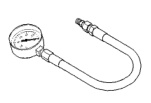
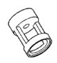
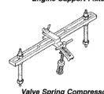
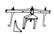
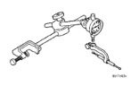
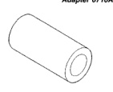
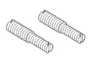

# SPECIAL TOOLS

## 3.9L ENGINE

*Fig. 1 Oil Pressure Gauge C-3292*

*Fig. 2 Adapter 6716A*

*Fig. 3 Engine Support Fixture C-3487-A*

*Fig. 4 Valve Guide Sleeve C-3973*

*Fig. 5 Valve Spring Compressor MD-998772-A*

*Fig. 6 Dial Indicator C-3339*

*Fig. 7 Adapter 6633*

*Fig. 8 Puller C-3688*