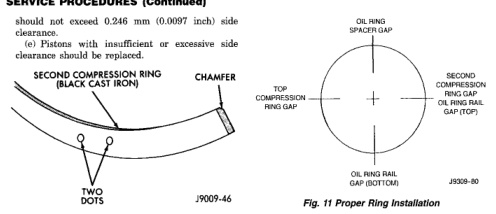
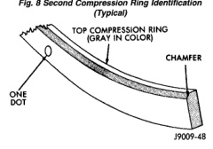
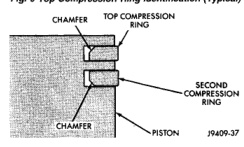

# SERVICE PROCEDURES (Continued)

should not exceed 0.246 mm (0.0097 inch) side clearance.

(c) Pistons with insufficient or excessive side clearance should be replaced.

*Fig. 8 Second Compression Ring Identification (Typical)]*
- SECOND COMPRESSION RING (BLACK CAST IRON)
- CHAMFER
- TWO DOTS
- J9009-46

*Fig. 9 Top Compression Ring Identification (Typical)]*
- TOP COMPRESSION RING (GRAY IN COLOR)
- CHAMFER
- ONE DOT
- J9009-48

*Fig. 12 Compression Ring-to-Chamfer Location (Typical)]*
- CHAMFER
- TOP COMPRESSION RING
- SECOND COMPRESSION RING
- CHAMFER
- PISTON
- J9409-37

## FITTING CONNECTING ROD BEARINGS

Fit all rods on a bank until completed. DO NOT alternate from one bank to another, because connecting rods and pistons are not interchangeable from one bank to another.

The bearing caps are not interchangeable and should be marked at removal to ensure correct assembly.

[Figure: Fig. 11 Proper Ring Installation]
- OIL RING SPACER GAP
- SECOND COMPRESSION RING GAP (TOP)
- OIL RING RAIL GAP (TOP)
- TOP COMPRESSION RING GAP
- OIL RING RAIL GAP (BOTTOM)
- J8268-80

Each bearing cap has a small V-groove across the parting face. When installing the lower bearing shell, make certain that the V-groove in the shell is in line with the V-groove in the cap. This provides lubrication of the cylinder wall in the opposite bank.

The bearing shells must be installed so that the tangs are in the machined grooves in the rods and caps.

Limits of taper or out-of-round on any crankshaft journals should be held to 0.025 mm (0.001 inch). Bearings are available in 0.025 mm (0.001 inch), 0.051 mm (0.002 inch), 0.076 mm (0.003 inch), 0.254 mm (0.010 inch) and 0.305 mm (0.012 inch) undersize. Install the bearings in pairs. DO NOT use a new bearing half with an old bearing half. DO NOT file the rods or bearing caps.

## CRANKSHAFT MAIN BEARINGS

Bearing caps are not interchangeable and should be marked at removal to ensure correct assembly. Upper and lower bearing halves are NOT interchangeable. Lower main bearing halves of No.2 and 4 are interchangeable.

Upper and lower No.3 bearing halves are flanged to carry the crankshaft thrust loads. They are NOT interchangeable with any other bearing halves in the engine (Fig. 12). Bearing shells are available in standard and the following undersizes: 0.25 mm (0.001 inch), 0.051 mm (0.002 inch), 0.076 mm (0.003 inch), 0.254 mm (0.010 inch) and 0.305 mm (0.012 inch). Never install an undersize bearing that will reduce clearance below specifications.

## CRANKSHAFT

A crankshaft which has undersize journals will be stamped with 1/4 inch letters on the milled flat on the No.8 crankshaft counterweight (Fig. 13).

FOR EXAMPLE: R2 stamped on the No.8 crankshaft counterweight indicates that the No.2 rod journal is 0.025 mm (0.001 in) undersize. M4 indicates that the No.4 main journal is 0.025 mm (0.001 in) undersize. RM2 indicates that the No.3 rod journal and the No.2 main journal is 0.025 mm (0.001 in) undersize.