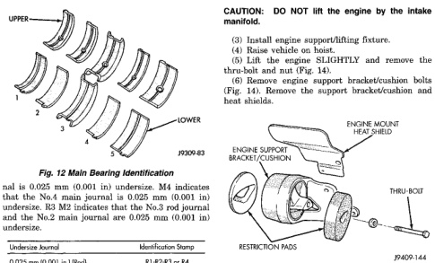
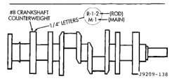

# SERVICE PROCEDURES (Continued)

*Fig. 15 Main Bearing Identification]*
- UPPER (bearings 1-5 shown)
- LOWER (bearings 1-5 shown)
- J9009-83

nal is 0.025 mm (0.001 in) undersize. M4 indicates that the No.4 main journal is 0.025 mm (0.001 in) undersize. RM2 indicates that the No.3 rod journal and the No.2 main journal is 0.025 mm (0.001 in) undersize.

| Undersize Journal | Identification Stamp |
|-------------------|----------------------|
| 0.025 mm (0.001 in.) (Rod) | R1-R2-R3 or R4 |
| 0.025 mm (0.001 in.) (Main) | M1-M2-M3-M4 or M5 |

*Fig. 16 Location of Crankshaft Identification]*
- #8 CRANKSHAFT COUNTERWEIGHT
- R (ROD)
- M (MAIN)
- J9409-118

When a crankshaft is replaced, all main and connecting rod bearings should be replaced with new bearings. Therefore, selective fitting of the bearings is not required when a crankshaft and bearings are replaced.

# REMOVAL AND INSTALLATION

## ENGINE MOUNTS—FRONT

### REMOVAL

(1) Disconnect the negative cable from the battery.
(2) Position fan to assure clearance for radiator top tank and hose.

(3) Install engine support/lifting fixture.
(4) Raise vehicle on hoist.
(5) Lift the engine SLIGHTLY and remove the thru-bolt and nut (Fig. 14).
(6) Remove the engine support bracket/cushion bolts (Fig. 14). Remove the support bracket/cushion and heat shields.

[Figure: Fig. 14 Engine Front Mounts]
- ENGINE MOUNT (REAR SHIELD)
- ENGINE SUPPORT BRACKET/CUSHION
- THRU-BOLT
- RESTRICTION PADS
- J9409-144

### INSTALLATION

(1) With engine raised SLIGHTLY, position the engine support bracket/cushion and heat shields to the block. Install new bolts and tighten to 81 N.m (60 ft. lbs.) torque.
(2) Install the thru-bolt into the engine support bracket/cushion.
(3) Lower engine with support/lifting fixture while guiding the engine bracket/cushion and thru-bolt into support cushion brackets (Fig. 15).
(4) Install thru-bolt nuts and tighten the nuts to 68 N.m (50 ft. lbs.) torque.
(5) Lower the vehicle.
(6) Remove lifting fixture.

## ENGINE MOUNT—REAR

### REMOVAL

(1) Raise the vehicle on a hoist.
(2) Position a transmission jack in place.
(3) Remove support cushion stud nuts (Fig. 16).
(4) Raise rear of transmission and engine SLIGHTLY.
(5) Remove the bolts holding the support cushion to the transmission support bracket. Remove the support cushion.
(6) If necessary, remove the bolts holding the transmission support bracket to the transmission.

**CAUTION: DO NOT lift the engine by the intake manifold.**