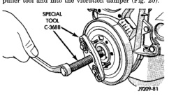
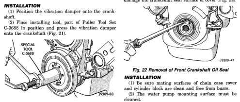

# 9-70 6.2L ENGINE BR

## REMOVAL AND INSTALLATION (Continued)

(5) Remove the vibration damper pulley.
(6) Remove vibration damper bolt and washer from end of crankshaft.
(7) Install bar and screw from Puller Tool Set C-3688. Install 2 bolts with washers through the puller tool and into the vibration damper (Fig. 20).

*Fig. 20 Vibration Damper Assembly]*
- SPECIAL TOOL C-3688
- 79209-81

(8) Pull vibration damper off of the crankshaft.

### INSTALLATION

(1) Position the vibration damper onto the crankshaft.
(2) Using the installing tool set of Puller Tool Set C-3688 in position and press the vibration damper onto the crankshaft (Fig. 21).

*Fig. 22 Installing Vibration Damper]*
- SPECIAL TOOL C-3688
- 79209-83

(3) Install the crankshaft bolt and washer. Tighten the bolt to 183 N·m (135 ft. lbs.) torque.
(4) Install the crankshaft pulley. Tighten the pulley bolts to 23 N·m (200 in. lbs.) torque.
(5) Install the accessory drive belt (refer to Group 7, Cooling System).
(6) Position the fan shroud and install the bolts. Tighten the retainer bolts to 11 N·m (95 in. lbs.) torque.
(7) Install the cooling fan.
(8) Connect the battery negative cable.

## TIMING CHAIN COVER

### REMOVAL

(1) Disconnect the negative cable from the battery.
(2) Drain cooling system (refer to Group 7, Cooling System).
(3) Remove the serpentine belt (refer to Group 7, Cooling System).
(4) Remove water pump (refer to Group 7, Cooling System).
(5) Remove power steering pump (refer to Group 19, Steering).
(6) Remove vibration damper.
(7) Loosen oil pan bolts and remove the front bolt at each side.
(8) Remove the cover bolts.
(9) Remove chain case cover and gasket using extreme caution to avoid damaging oil pan gasket.
(10) Place a suitable tool behind the lips of the oil seal to pry the oil seal outward. Be careful not to damage the crankshaft seal surface of cover (Fig. 22).

[Figure: Fig. 22 Removal of Front Crankshaft Oil Seal]
- SEAL
- 28303-47

### INSTALLATION

(1) Be sure mating surfaces of chain case cover and cylinder block are clean and free from burrs.
(2) The water pump mounting surface must be cleaned.
(3) Using a new cover gasket, carefully install chain case cover to avoid damaging oil pan gasket. Use a small amount of Mopar® Silicone Rubber Adhesive Sealant, or equivalent, at the joint between timing chain cover gasket and the oil pan gasket. Finger tighten the timing chain cover bolts at this time.
(4) Place the smaller diameter of the oil seal over Front Oil Seal Installation Tool 6635 (Fig. 23). Seat the oil seal in the groove of the tool.
(5) Position the seal and tool onto the crankshaft (Fig. 24).
(6) Tighten the 4 lower chain case cover bolts to 13 N·m (10 ft. lbs.) to prevent the cover from tipping during seal installation.
(7) Using the vibration damper bolt, tighten the bolt to draw the seal into position on the crankshaft (Fig. 25).