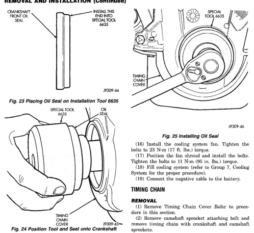

# 5.2L ENGINE - BR
## REMOVAL AND INSTALLATION (Continued)

*Fig. 26 Placing Oil Seal on Installation Tool 6635]*
- CRANKSHAFT FRONT SEAL
- INSTALL THIS END INTO SEAL FIRST 6635
- SPECIAL TOOL 6635

[Figure: Fig. 24 Position Tool and Seal onto Crankshaft]
- SPECIAL TOOL 6635
- TIMING CHAIN COVER
- JX309-12

(9) Loosen the 4 bolts tightened in step 4 to allow realignment of front cover assembly.
(10) Tighten chain case cover bolts to 41 N·m (30 ft. lbs.) torque. Tighten oil pan bolts to 24 N·m (215 in. lbs.) torque.
(11) Remove the vibration damper bolt and seal installation tool.
(12) Inspect the seal flange on the vibration damper.
(13) Install vibration damper.
(14) Install water pump and housing assembly using new gaskets (refer to Group 7, Cooling System). Tighten bolts to 41 N·m (30 ft. lbs.) torque.
(15) Install power steering pump (refer to Group 19, Steering).
(16) Install the serpentine belt (refer to Group 7, Cooling System).

[Figure: Fig. 25 Installing Oil Seal]
- SPECIAL TOOL 6635
- TIMING CHAIN COVER
- JX309-46

(17) Install the cooling system fan. Tighten the bolts to 7 N·m (60 in. lbs.) torque.
(18) Position the fan shroud and install the bolts. Tighten the bolts to 11 N·m (95 in. lbs.) torque.
(19) Fill cooling system (refer to Group 7, Cooling System for the proper procedure).
(20) Connect the negative cable to the battery.

### TIMING CHAIN

#### REMOVAL

(1) Remove Timing Chain Cover Refer to procedure in this section.
(2) Remove camshaft sprocket attaching bolt and remove timing chain with crankshaft and camshaft sprockets.

#### INSTALLATION

(1) Place both camshaft sprocket and crankshaft sprocket on the bench with timing marks on exact imaginary center line through both camshaft and crankshaft bores.
(2) Place timing chain around both sprockets.
(3) Turn crankshaft and camshaft to line up with keyway location in crankshaft sprocket and in camshaft sprocket.
(4) Lift sprockets and chain (keep sprockets tight against the chain in position as described).
(5) Slide both sprockets evenly over their respective shafts and use a straightedge to check alignment of timing marks (Fig. 26).
(6) Install the camshaft bolt. Tighten the bolt to 68 N·m (50 ft. lbs.) torque.