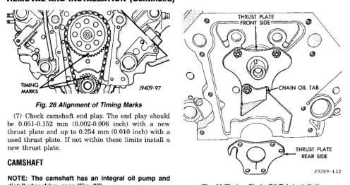
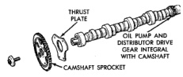
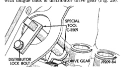

# 5.2L ENGINE - BR
## REMOVAL AND INSTALLATION (Continued)

*Fig. 27 Alignment of Timing Marks]*
- TIMING MARKS
- JX309-57

(7) Check camshaft end play. The end play should be 0.051 to 152 mm (0.002-0.006 inch) with a new thrust plate and up to 0.254 mm (0.010 inch) with a used thrust plate. If not within these limits install a new thrust plate.

### CAMSHAFT

**NOTE:** The camshaft has an integral oil pump and distributor drive gear (Fig. 27).

*Fig. 28 Camshaft and Sprocket Assembly]*
- THRUST PLATE
- OIL PUMP AND DISTRIBUTOR DRIVE GEAR INTEGRAL WITH CAMSHAFT
- CAMSHAFT SPROCKET
- JX309-71

#### REMOVAL

(1) Remove intake manifold.
(2) Remove cylinder head covers.
(3) Remove timing case cover and timing chain.
(4) Remove rocker arms.
(5) Remove push rods and tappets. Identify each part so it can be installed in its original location.
(6) Remove distributor and lift out the oil pump and distributor drive shaft.
(7) Remove camshaft thrust plate, note location of oil tab (Fig. 28).
(8) Install a long bolt into front of camshaft to facilitate removal of the camshaft. Remove camshaft, being careful not to damage cam bearings with the cam lobes.

#### INSTALLATION

(1) Lubricate camshaft lobes and camshaft bearing journals and insert the camshaft to within 51 mm (2 inches) of its final position in cylinder block.

*Fig. 29 Timing Chain Oil Tab Installation]*
- THRUST PLATE FRONT SIDE
- CHAIN OIL TAB
- THRUST PLATE REAR SIDE
- JX309-132

**NOTE:** Whenever an engine has been rebuilt, a new camshaft and/or new tappets installed, add 1 pint of Mopar Crankcase Conditioner, or equivalent. The oil mixture should be left in engine for a minimum of 805 km (500 miles). Drain at the next normal oil change.

(2) Install Camshaft Gear Installer Tool C-3509 with tongue back of distributor drive gear (Fig. 29).

[Figure: Fig. 29 Camshaft Installer Tool C-3509 (Installed Position)]
- SPECIAL TOOL C-3509
- DISTRIBUTOR DRIVE GEAR LOCK BOLT
- JX309-44

(3) Hold tool in position with a distributor lockplate bolt. This tool will restrict camshaft from being pushed in too far and prevent knocking out the welch plug in rear of cylinder block. Tool should remain installed until the camshaft and crankshaft sprockets and timing chain have been installed.
(4) Install camshaft thrust plate and chain oil tab. Make sure tang enters lower right hole in thrust plate. Tighten bolts to 24 N·m (210 in. lbs.)