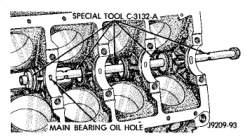
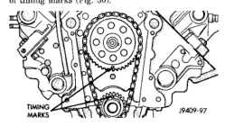

# 5.2L ENGINE 9-73
## BR
## REMOVAL AND INSTALLATION (Continued)

torque. Top edge of tab should be flat against thrust plate in order to catch oil for chain lubrication.

(5) Place both camshaft sprocket and crankshaft sprocket on the bench with timing marks on exact imaginary center line through both camshaft and crankshaft bores.

(6) Place timing chain around both sprockets.

(7) Turn crankshaft and camshaft to line up with keyway location in crankshaft sprocket and in camshaft sprocket.

(8) Lift sprockets and chain (keep sprockets tight against the chain in position as described).

(9) Slide both sprockets evenly over their respective shafts and use a straightedge to check alignment of timing marks (Fig. 30).

*Fig. 30 Alignment of Timing Marks]*

(10) Install the camshaft bolt/cup washer. Tighten bolt to 68 N·m (50 ft. lbs.) torque.

(11) Measure camshaft end play. Refer to Specifications for proper clearance. If not within limits install a new thrust plate.

(12) Each tappet reused must be installed in the same position from which it was removed. When camshaft is replaced, all of the tappets must be replaced.

### CAMSHAFT BEARINGS

#### REMOVAL

**NOTE:** This procedure requires that the engine is removed from the vehicle.

(1) With engine completely disassembled, drive out rear cam bearing core hole plug.

(2) Install proper size adapters and horseshoe washers (part of Camshaft Bearing Remover/Installer Tool C-3132-A) at back of each bearing shell. Drive out bearing shells (Fig. 31).

#### INSTALLATION

(1) Install new camshaft bearings with Camshaft Bearing Remover/Installer Tool C-3132-A by sliding the new camshaft bearing shell over proper adapter.

*Fig. 31 Camshaft Bearings Removal/Installation with Tool C-3132-A]*

(2) Position rear bearing in the tool. Install horseshoe lock and by reversing removal procedure, carefully drive bearing shell into place.

(3) Install remaining bearings in the same manner. Bearings must be carefully aligned to bring oil holes into full register with oil passages from the main bearing. If the camshaft bearing shell oil holes are not in exact alignment, remove and install them correctly. Install a new core hole plug at the rear of camshaft. Be sure this plug does not leak.

### CRANKSHAFT MAIN BEARINGS

#### REMOVAL

(1) Remove the oil pan.

(2) Remove the oil pump from the rear main bearing cap.

(3) Identify bearing caps before removal. Remove bearing caps one at a time.

(4) Remove upper half of bearing by inserting Crankshaft Main Bearing Remover/Installer Tool C-3059 into the oil hole of crankshaft (Fig. 32).

(5) Slowly rotate crankshaft clockwise, forcing out upper half of bearing shell.

#### INSTALLATION

Only one main bearing should be selectively fitted while all other main bearing caps are properly tightened. All bearing cap bolts removed during service procedures are to be cleaned and oiled before installation.

When installing a new upper bearing shell, slightly chamfer the sharp edges from the plain side.

(1) Start bearing in place, and insert Crankshaft Main Bearing Remover/Installer Tool C-3059 into oil hole of crankshaft (Fig. 32).

(2) Slowly rotate crankshaft counterclockwise sliding the bearing into position. Remove Tool C-3059.

(3) Install the bearing caps. Clean and oil the bolts. Tighten the cap bolts to 115 N·m (85 ft. lbs.) torque.

(4) Install the oil pump.

(5) Install the oil pan.