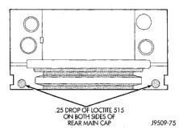
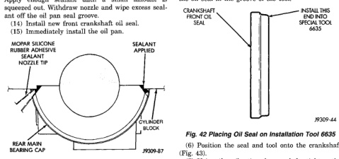

# REMOVAL AND INSTALLATION (Continued)

*Fig. 41 Sealant Application to Bearing Cap]*
- 25 DROPS OF LOCTITE 515 OR EQUIVALENT
- CAP ALIGNMENT SLOT

(13) Apply Mopar® Silicone Rubber Adhesive Sealant, or equivalent, at bearing cap to block joint to provide cap to block and oil pan sealing (Fig. 40). Apply enough sealant until a small amount is squeezed out. Withdraw nozzle and wipe excess sealant off the oil pan seal groove.

(14) Install new front crankshaft oil seal.

(15) Immediately install the oil pan.

*Fig. 42 Apply Sealant to Bearing Cap to Block Joint]*
- MOPAR SILICONE RUBBER ADHESIVE SEALANT NOZZLE TIP
- CYLINDER BLOCK
- REAR MAIN BEARING CAP

## OIL PUMP

### REMOVAL

(1) Remove the oil pan.

(2) Remove the oil pump from rear main bearing cap.

### INSTALLATION

(1) Install oil pump. During installation slowly rotate pump body to ensure driveshaft-to-pump rotor shaft engagement.

(2) Hold the oil pump base flush against mating surface on No.5 main bearing cap. Finger tighten pump attaching bolts. Tighten attaching bolts to 41 N·m (30 ft. lbs.) torque.

(3) Install the oil pan.

## FRONT CRANKSHAFT OIL SEAL

The oil seal can be replaced without removing the timing chain cover provided the cover is not misaligned.

(1) Disconnect the negative cable from the battery.

(2) Remove vibration damper.

(3) If front seal is suspected of leaking, check front oil seal alignment to crankshaft. The seal installation/alignment tool 6635, should fit with minimum interference. If tool does not fit, the cover must be removed and installed properly.

(4) Place a suitable tool behind the lips of the oil seal to pry the oil seal outward. Be careful not to damage the crankshaft seal bore of cover.

(5) Place the smaller diameter of the oil seal over Front Oil Seal Installation Tool 6635 (Fig. 42). Seat the oil seal in the groove of the tool.

[Figure: Fig. 42 Placing Oil Seal on Installation Tool 6635]
- CRANKSHAFT FRONT OIL SEAL
- INSTALL INTO SPECIAL TOOL THIS END
- OIL SEAL

(6) Position the seal and tool onto the crankshaft (Fig. 43).

(7) Using the vibration damper bolt, tighten the bolt to draw the seal into position on the crankshaft (Fig. 44).

(8) Remove the vibration damper bolt and seal installation tool.

(9) Inspect the seal flange on the vibration damper.

(10) Install the vibration damper.

(11) Connect the negative cable to the battery.

## CRANKSHAFT REAR OIL SEALS

The service seal is a 2 piece, viton seal. The upper seal half can be installed with crankshaft removed from engine or with crankshaft installed. When a new upper seal is installed, install a new lower seal.