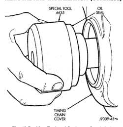
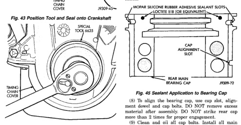

# REMOVAL AND INSTALLATION (Continued)

*Fig. 43 Position Tool and Seal onto Crankshaft]*
- SPECIAL TOOL
- OIL SEAL
- TIMING CHAIN COVER

The lower seal half can only be installed with the rear main bearing cap removed.

## UPPER SEAL—CRANKSHAFT REMOVED

### REMOVAL

(1) Remove the crankshaft. Discard the old upper seal.

### INSTALLATION

(1) Clean the cylinder block rear cap mating surface. Make sure the seal groove is free of debris.

(2) Lightly oil the new upper seal lips with engine oil.

(3) Install the new upper rear bearing oil seal with the white paint facing towards the rear of the engine.

(4) Position the crankshaft into the cylinder block.

(5) Lightly oil the new lower seal lips with engine oil.

(6) Install the new lower rear bearing oil seal into the bearing cap with the white paint facing towards the rear of the engine.

(7) Apply 5 mm (0.20 in) drop of Loctite 518, or equivalent, on each side of the rear main bearing cap (Fig. 45). DO NOT over apply sealant or allow the sealant to contact the rubber seal. Assemble bearing cap to cylinder block immediately after sealant application.

*Fig. 45 Sealant Application to Bearing Cap]*
- MOPAR SILICONE RUBBER ADHESIVE SEALANT SPOTS
- LOCTITE 518 (OR EQUIVALENT)
- CAP ALIGNMENT SLOT
- REAR MAIN BEARING CAP

(8) To align the bearing cap, use cap slot, alignment dowel and cap bolts. DO NOT remove excess material after assembly. DO NOT strike rear cap more than 2 times for proper engagement.

(9) Clean and oil all cap bolts. Install all main bearing caps. Install all cap bolts and alternately tighten to 115 N·m (85 ft. lbs.) torque.

(10) Install oil pump.

(11) Apply Mopar Silicone Rubber Adhesive Sealant, or equivalent, at bearing cap to block joint to provide cap to block and oil pan sealing (Fig. 46). Apply enough sealant until a small amount is squeezed out. Withdraw nozzle and wipe excess sealant off the oil pan seal groove.

(12) Install new front crankshaft oil seal.

(13) Immediately install the oil pan.

[Figure: Fig. 44 Installing Oil Seal]