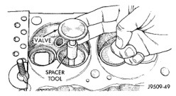
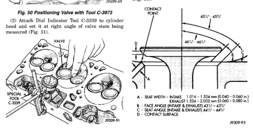

# BR 5.2L ENGINE 9-81

## DISASSEMBLY AND ASSEMBLY (Continued)

### VALVE SERVICE

#### VALVE GUIDES

Measure valve stem guide clearance as follows:

(1) Install Valve Guide Sleeve Tool C-3973 over valve stem and install valve (Fig. 50). The special sleeve places the valve at the correct height for checking with a dial indicator.

*Fig. 50 Positioning Valve with Tool C-3973]*

*Fig. 52 Measuring Valve Guide Wear]*

(3) Move valve to and from the indicator. The total dial indicator reading should not exceed 0.432 mm (0.017 inch). Ream the guides for valves with oversize stems if dial indicator reading is excessive or if the stems are scuffed or scored.

(4) Service valves with oversize stems are available (Fig. 52).

(5) Slowly turn reamer by hand and clean guide thoroughly before installing new valve. Ream the valve guides from standard to 0.381 mm (0.015 inch). Use a 2 step procedure so the valve guides are reamed true in relation to the valve seat:

• Step 1—Ream to 0.0763 mm (0.003 inch).

| Reamer O/S | Valve Guide Size |
|------------|------------------|
| 0.076 mm (0.003 in.) | 8.026 - 8.052 mm (0.316 - 0.317 in.) |
| 0.381 mm (0.015 in.) | 8.331 - 8.357 mm (0.328 - 0.329 in.) |

[Figure: Fig. 52 Reamer Sizes]

• Step 2—Ream to 0.381 mm (0.015 inch).

#### REFACING VALVES AND VALVE SEATS

The intake and exhaust valves have a 43-1/4° to 43-3/4° face angle and a 44-1/4° to 44-3/4° seat angle (Fig. 53).

[Figure: Fig. 53 Valve Face and Seat Angles
• A - SEAT WIDTH - INTAKE 1.016 - 1.524 mm (0.040 - 0.060 in.)
• B - SEAT WIDTH - EXHAUST 1.524 - 2.032 mm (0.060 - 0.080 in.)
• C - SEAT ANGLE (INTAKE & EXHAUST) 44°/° - 44°/°
• D - CONTACT SURFACE]

Inspect the remaining margin after the valves are refaced (Fig. 54). Valves with less than 1.190 mm (0.047 inch) margin should be discarded.

#### VALVE SEATS

**CAUTION: DO NOT un-shroud valves during valve seat refacing (Fig. 55).**

(1) When refacing valve seats, it is important that the correct size valve guide pilot be used for reseating stones. A true and complete surface must be obtained.