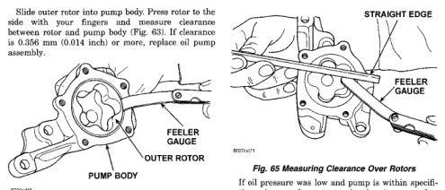
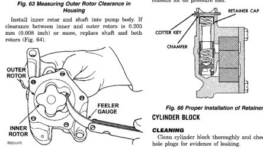

# CLEANING AND INSPECTION (Continued)

Slide inner rotor into pump body. Press rotor to the side with your fingers and measure clearance between rotor and pump body (Fig. 63). If clearance is 0.356 mm (0.014 inch) or more, replace oil pump assembly.

*Fig. 65 Measuring Outer Rotor Clearance in Housing]*

Place a straightedge across the face of the pump, between bolt holes. If a feeler gauge of 0.102 mm (0.004 inch) or more can be inserted between rotors and the straightedge, replace pump assembly (Fig. 65).

Inspect oil pressure relief valve plunger for scoring and free operation in its bore. Small marks may be removed with 400-grit wet or dry sandpaper.

The relief valve spring has a free length of approximately 49.5 mm (1.95 inches). The spring should test between 19.5 and 20.5 pounds when compressed to 34 mm (1-11/32 inches). Replace spring that fails to meet these specifications (Fig. 66).

*Fig. 66 Measuring Clearance Between Rotors]*

[Figure: Fig. 65 Measuring Clearance Over Rotors]

If oil pressure was low and pump is within specifications, inspect for worn engine bearings or other reasons for oil pressure loss.

[Figure: Fig. 66 Proper Installation of Retainer Cap]

## CYLINDER BLOCK

### CLEANING

Clean cylinder block thoroughly and check all core hole plugs for evidence of leaking.

### INSPECTION

Examine block for cracks or fractures.

The cylinder walls should be checked for out-of-round and taper with Cylinder Bore Indicator Tool C-119. The cylinder block should be bored and honed with new pistons and rings fitted if:

• The cylinder bores show more than 0.127 mm (0.005 in.) out-of-round.
• The cylinder bores show a taper of more than 0.254 mm (0.010 in.).
• The cylinder walls are badly scuffed or scored.

Boring and honing operation should be closely coordinated with the fitting of pistons and rings, so that specified clearances can be maintained.