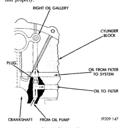

# CLEANING AND INSPECTION (Continued)

## OIL LINE PLUG

The oil line plug is located in the vertical passage at the rear of the block between the oil-to-filter and oil-from-filter passages (Fig. 67). Improper installation or plug missing could cause erratic, low, or no oil pressure.

The oil plug must come out the bottom. Use flat dowel, down the oil pressure sending unit hole from the top, to remove oil plug.

(1) Remove oil pressure sending unit from back of block.

(2) Insert a 3.175 mm (1/8 in.) finish wire, or equivalent, into passage.

(3) Plug should be 190.0 to 195.2 mm (7-1/2 to 7-11/16 in.) from machined surface of block (Fig. 67). If plug is too high, use a suitable flat dowel to position properly.

*Fig. 67 Oil Line Plug]*

(4) If plug is too low, remove oil pan and No. 4 main bearing cap. Use suitable flat dowel to position properly. Coat outside diameter of plug with Mopar Stud and Bearing Mount Adhesive, or equivalent. Plug should be 54.0 to 57.7 mm (2-1/8 to 2-5/16 in.) from bottom of the block.

# SPECIFICATIONS

## 5.2L ENGINE SPECIFICATIONS

### GENERAL INFORMATION

| Specification | Value |
|---|---|
| Engine Type | 90° V-8 OHV |
| Displacement | 5.2L (318 c.i.) |
| Compression Ratio | 9.1:1 |
| Firing Order | 1-8-4-3-6-5-7-2 |
| Lubrication | Pressure Feed—Full Flow Filtration |
| Cooling System | Liquid Cooled—Forced Circulation |
| Cylinder Block | Cast Iron |
| Crankshaft | Nodular Iron |
| Cylinder Head | Cast Iron |
| Combustion Chambers | Wedge-High Swirl Valve shrouding |
| Camshaft | Nodular Cast Iron |
| Pistons | Aluminum Alloy w/insert |
| Connecting Rods | Forged Steel |
| Bore and Stroke | 99.3 x 84.0 mm (3.91 x 3.31 in.) |

### CAMSHAFT

**Bearing Diameter**

| Bearing | Diameter |
|---|---|
| No. 1 | 50.851 - 50.876 mm (2.002 - 2.003 in.) |
| No. 2 | 50.394 - 50.419 mm (1.984 - 1.985 in.) |
| No. 3 | 50.013 - 50.038 mm (1.969 - 1.970 in.) |
| No. 4 | 49.606 - 49.632 mm (1.953 - 1.954 in.) |
| No. 5 | 39.688 - 39.713 mm (1.5625 - 1.5635 in.) |

**Bearing Journal Diameter**

| Journal | Diameter |
|---|---|
| No. 1 | 50.749 - 50.775 mm (1.998 - 1.999 in.) |
| No. 2 | 50.292 - 50.317 mm (1.980 - 1.981 in.) |
| No. 3 | 49.962 - 49.987 mm (1.967 - 1.968 in.) |
| No. 4 | 49.555 - 49.581 mm (1.951 - 1.952 in.) |
| No. 5 | 39.637 - 39.662 mm (1.5605 - 1.5615 in.) |

**Bearing to Journal Clearance**

| Type | Clearance |
|---|---|
| Standard | 0.025 - 0.076 mm (0.001 - 0.003 in.) |
| Service Limit | 0.254 mm (0.010 in.) |

**Camshaft End Play**

| Type | End Play |
|---|---|
| End Play | 0.051 - 0.254 mm (0.002 - 0.010 in.) |

### CONNECTING RODS

| Specification | Value |
|---|---|
| Piston Pin bore Diameter | 24.966 - 24.978 mm (0.9829 - 0.9834 in.) |
| Side Clearance | 0.152 - 0.356 mm (0.006 - 0.014 in.) |

### CRANKSHAFT

**Rod Journal**

| Specification | Value |
|---|---|
| Diameter | 53.950 - 53.975 mm (2.124 - 2.125 in.) |
| Out of Round (Max.) | 0.0254 mm (0.001 in.) |
| Taper (Max.) | 0.0254 mm (0.001 in.) |
| Bearing Clearance | 0.0013 - 0.056 mm (0.0005 - 0.0022 in.) |