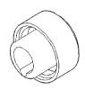
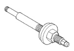
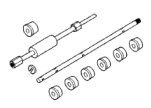
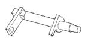
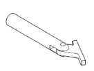
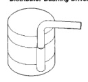
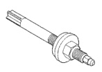
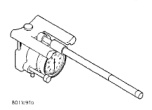

# BR 5.2L ENGINE 9-91

## SPECIAL TOOLS (Continued)

*Fig. 1 Front Oil Seal Installer 6635*

*Fig. 2 Distributor Bushing Driver/Burnisher C-3053*

*Fig. 3 Cam Bearing Remover/Installer C-3132-A*

*Fig. 4 Piston Ring Compressor C-365*

*Fig. 5 Camshaft Holder C-3509*

*Fig. 6 Crankshaft Main Bearing Remover C-3059*

*Fig. 7 Distributor Bushing Puller C-3052*

*Fig. 8 Cylinder Bore Gauge C-119*