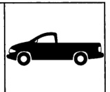
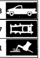
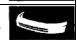
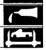

### Dodge Ram Pickup

*Fig. 1*

*Fig. 2*

his manual shows:

Navigation Tools: Click on the "Table of Contents" below, or use the Bookmarks to the left.

*Fig. 3*

This manual has been prepared for use by all body technicians involved the repair of the new Dodge Dakota Pickup.

Typical body panels contained in the new Dodge Ram Pickup

The weld locations for these panels

The types of welds for the panels

Proper sealer types and correct locations

*Fig. 4*

Body Construction Characteristics ........ 3

Frame Construction Characteristics ... 27

Welded Panel Replacement ........................................................ 31

*Fig. 5*

Bumper Systems .

*Fig. 6*

Exterior Lighting

Structural Adhesives .

*Fig. 7*

Body Sealing Locations ................................................................................................... 99

Body Dimensions & Specifications ... 109

Chrysler Corporation reserves the right to make improvements in design or to change specifications to these venicles without incurring any obligation upon itself.

1
