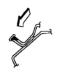
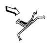
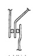
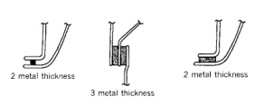
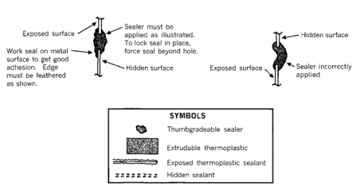

*Fig. 1*

Hold gun nozzle in direction of arrow in order to effectively

*seal metal joints.*

*Fig. 2*

3 metal thickness

*Fig. 3*

Do not hold gun nozzle in direction of arrow. Sealer applied as shown is ineffective.

*Fig. 4*

*3 metal thickness*

*Fig. 5*
