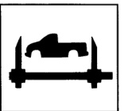
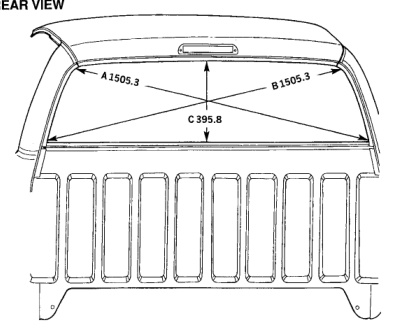

### BODY DIMENSIONS & SPECIFICATIONS

### Dodge Ram Pickup

REAR VIEW

A & B.

C.

*Fig. 1*

*Fig. 2*

Center of radius at top corner to center of radius at lower corner of glass mounting flange.

Lower edge of upper back glass mounting flange to upper edge of lower back glass mounting flange measurement taken at centerline of rear glass opening.

Note: All measurements are in mm. Dimensions referred from PLP holes are from centerline of hole.
