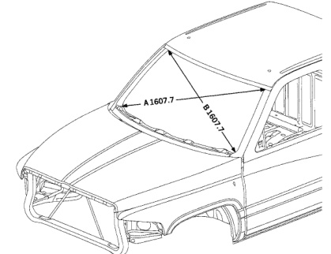

*Fig. 1*

*Fig. 2*

A & B. Upper corner of windshield opening to top of radius at lower corner of opening.

Note: All measurements are in mm. Dimensions referred from PLP holes are from centerline of hole.
