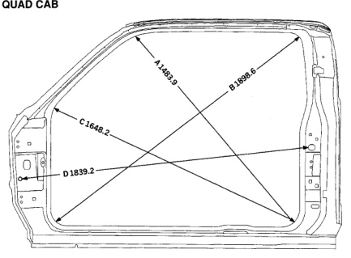

*Fig. 1*

QUAD CAB

A.

B.

C.

D.

*Fig. 2*

Centerline of A-Pillar gaging hole to centerline of seat belt retractor hole at B-Pillar.

Center of radius at rear lower door opening flange inner edge to center of radius at cowl flange edge.

Center of radius at front lower door opening flange inner edge to center of radius at upper opening rear flange inner edge.

Center of radius at rear lower door opening flange inner edge to center of radius at upper front flange inner edge.

Note: All measurements are in mm. Dimensions referred from PLP holes are from centerline of hole.
