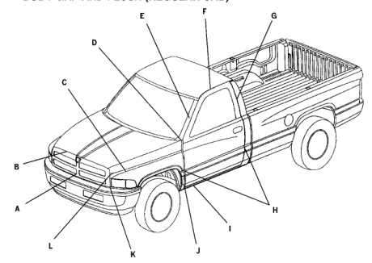

*Fig. 1*

### Dimensions & Specifications

BODY GAP AND FLUSH (REGULAR CAB)

*Fig. 2*

FLUSH DESCRIPTION GAP N/A A Grille to Fascia 19.0 +/- 3.0 B 1.5 + / - 0.75 0.0 +0.0/-1.0 Hood to Grille C 6.0 +/-1.0 3.5 +/-1.0 Hood to Fender 0.0 +/- 1.0 D Door to Hood / Fender 5.0 +/- 1.0 N/A 2.0 + / - 2.0 E Door to Windshield Molding F 2.0 + / - 1.0 6.0 + / - 1.5 Door to Roof G 5.0 +/ - 1.0 0.0 + / - 1.0 Door to Quarter H 0.0 + / - 1.0 Fender / Door / Quarter Char Line U/D N/A 0.0 + / - 1.5 - Door to Sill 7.7 + / - 2.0 0.0 + / - 1.0 J 5.0 +/ - 1.0 Fender to Aperture N/A K Grille to Headlamp 6.0 + / - 3.0 1.0 +/- 0.5 ﺎ 5.0 +/-0.75 Grille to Fender

Note: Ali measurements are in mm.
