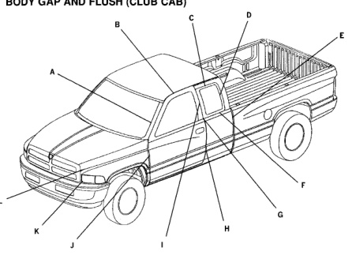

BODY GAP AND FLUSH (CLUB CAB)

*Fig. 1*

*Fig. 2*

ﺎ

Note: All measurements are in mm.

DESCRIPTION GAP FLUSH 2.0 + / - 2.0 A Door to Windshield Molding N/A 6.0 + / - 1.5 2.0 +/-1.0 B Door to Roof C 5.0 +/ - 1.0 3.25 + / - 1.5 Quarter Glass to Quarter (top) 5.0 + / - 2.0 3.25 + / - 1.5 D Quarter Glass to Quarter (rear) 31.0+/-3.0 3.5+/-2.5 E Cab to Box (side view) F 5.0 + / - 1.5 N/A Quarter Glass to Quarter (bottom) in-line within +/- 1.0 G Quarter Glass to Quarter (front) 0.0 + / - 1.0 H Door to Quarter 5.0 + / - 1.0 2.0 + / - 1.5 - Quarter Glass to Door N/A 0.0 +/ - 1.0 J 5.0 +/ - 1.0 Door to Hood / Fender 6.0 + / - 3.0 N/A K Grille to Headlamp L Grille to Fender 5.0 +/-0.75 1.0 + / - 0.5
