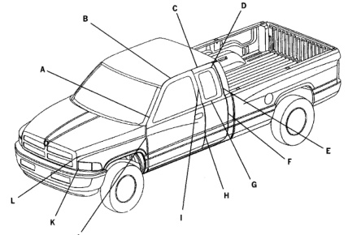

*Fig. 1*

### Dimensions & Specifications

### BODY GAP AND FLUSH (QUAD CAB)

*Fig. 2*

DESCRIPTION GAP FLUSH 2.0 + / - 2.0 A Door to Windshield Molding N/A 0.0 + / - 1.0 B 5.0 + / - 1.5 Front Door to Roof C 0.0 + / - 1.0 5.0 + / - 1.0 Rear Door to Roof D 5.0 +/-1.0 3.25 + / - 1.5 Rear Door Glass to Rear Door (top) 3.25+/-1.5 E Rear Door Glass to Rear Door (rear) 5.0 +/-2.0 F 0.0 + / - 1.0 Rear Door to Quarter 5.5 +/-1.0 5.0 + / - 1.5 N/A G Rear Door Glass to Rear Door (bottom) 5.0 +/- 1.0 0.0 + / - 1.0 H Front Door to Rear Door in-line within +/- 1.0 - Rear Door Glass to Rear Door (front) 3.25+/-1.5 Rear Door Glass to Front Door N/A 0.0 +/ - 1.0 J 5.0+/-1.0 Door to Hood / Fender N/A K 6.0 +/-3.0 Grille to Headlamp 1.0 +/- 0.5 ﺎ Grille to Fender 5.0 +/-0.75

Note: All measurements are in mm.
