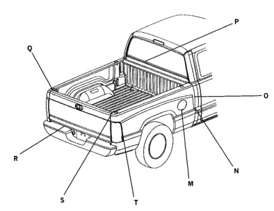

*Fig. 1*

*Fig. 2*

### BODY GAP AND FLUSH (CARGO BOX)

*Fig. 3*

DESCRIPTION GAP FLUSH 3.0 +/ - 0.75 0.0 + / - 3.0 M Fuel Filler Door to Box N/A 0.0 +/ - 3.0 N Cab to Box Character Line U/D 31.0+/-3.0 5.0 + / - 2.5 0 Cargo to Box (side) 34.0 +/-3.0 P N/A Cab to Box at Centerline 1.0+/-1.5 Q N/A Box to Tailgate U/D 43.0 +/ - 3.0 N/A R Tailgate to Bumper Box to Tailgate S 6.0 + / - 1.5 1.0 + / - 1.5 T 4.0 + / - 1.5 Box to Tailgate 1.0 + / - 1.0

Note: All measurements are in mm.
