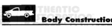

nstruction Characteristics

*Fig. 1*

*Fig. 2*

The following measures have been implemented in order to provide maximum corrosion prevention and protection.

1. The use of galvannealed coatings throughout the body structure.

2. Cationic electrode position undercoating is used on the complete body in all instances.

3. Body sealing.

4. Stone-chipping resistant primer application.

5. Underbody corrosion prevention.

Pickup:

MS 66- Represents an uncoated cold-rolled structural steel used mainly for interior braces and reinforcements.

MS 67- Represents an uncoated structural steel used in areas where structural integrity is critical. Eg., the type of steel used for the "A" pillar.

MS 264-050-XK- Represents an uncoated high strength steel used in applications where structural integity is critical.

Two-Sided Galvannealed MS 6000-44A- Represents a two-sided zinc coated steel in which the coating is fully alloved with the sheet or strip surface.

Two-Sided Galvannealed MS 6000-44VA- Represents a two-sided zinc-iron coated high strength steel in which the coating is fully alloyed with the sheet or strip surface.

PARTIAL LIST OF GALVANNEALED PANELS Front Wheelhouse Inner Panel

Inner Fender Panel

Cowl Bar Panel

Hinge Pillar Reinforcement

Windshield Side Opening

Front Header

Roof Panel

Outer Box Side Panel

Inner Box Side Panel

Box Front Center Panel

Box Front End Panel

Rear Wheelhouse Inner Panel

Tailgate Panel

Box Floor Crossmembers

Box Floor Panel

Center Floor Pan

Outer Floor Pan

Seat Belt Anchor and Reinforcement

Cowl Side Panel

Plenum End Panel

Plenum Lower Panel

Cowl Bar Panel

Lower Plenum Panel

Dash Panel

Body Side Aperture

Inner Rear Quarter Panel

Outer Rear Quarter Panel
