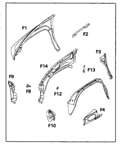
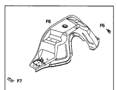

The outer fender assembly is made up of several components, none of which are serviced separately. The outer fender is serviced as a complete assembly only.

1. Outer fender panel (F1).

2. Upper fender reinforcement (F2).

3. Fender aperture reinforcement (F3).

4. Front fender reinforcement (F4).

5. Horn sensor tapping plate (F8).

6. Lower headlamp mounting panel (F9).

7. Upper headlamp mounting panel (F10).

8. Outer front wheelhouse panel (F11).

9. Inner fender to battery tray reinforcement (F12).

10. Inner fender tapping plate (F13). 11. Inner fender panel (F14).

The inner wheelhouse assembly is serviced separately from the fender assembly. The assemblies are welded together to form part of the front body.

1. Inner wheelhouse to floor reinforcement (F5).

2. Inner front wheelhouse panel (F6).

3. Inner fender to wheelhouse reinforcement (F7).

*Fig. 1*

*Fig. 2*
