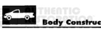
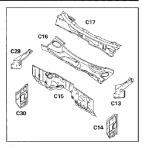
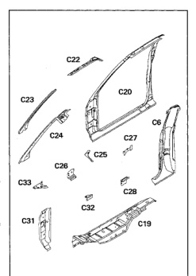

*Fig. 1*

The right and left cowl side panels, plenum end panels, cowl bar, plenum lower panel and dash panel make up the cowl assembly. All panels are serviced separately.

1. Plenum end panel, left side (C13).

2. Cowl side panel, left side (C14).

3. Dash panel (C15).

4. Plenum lower panel (C16).

5. Cowl bar panel (C17).

6. Plenum end panel, right side (C29).

7. Cowl side panel, right side (C30).

The body side aperture is made up of several components layered and welded together. All components are serviced separately.

1. Rear quarter outer panel (C6).

2. Outer floor pan (C19).

3. Body side aperture (C20).

4. Roof side inner rail (C22).

5. Windshield side opening frame reinforcement (C23).

6. Windshield side opening frame (C24).

7. Cowl to pillar inner reinforcement (C25).

8. Body side hinge pillar upper tapping plate (C26).

9. Retractor mounting reinforcement (C27). 10. Body side hinge pillar lower tapping plate (C28).

11. Body side hinge pillar reinforcement(C31).

12. Aperture to fender bracket (C32).

13. Cowl side to fender reinforcement (C33).

16

*Fig. 2*

*Fig. 3*
