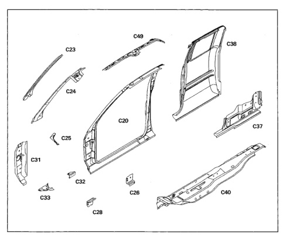

*Fig. 1*

All body side aperture is made up of several components layered and welded together. All panels are serviced separately.

1. Body side aperture (C20).

2. Windshield side opening frame reinforcement (C23).

3. Windshield side opening frame (C24).

4. Cowl to pillar inner reinforcement (C25).

5. Body side hinge pillar lower tapping plate (C26).

6. Retractor mounting reinforcement (C27).

*Fig. 2*

### Body Construction Characteristics

7. Body side hinge pillar lower tapping plate (C28)

8. Aperture to fender bracket (C32)

9. Cowl side to floor reinforcement (C33).

10. Rear quarter inner lower panel (C37).

11. Rear guarter outer panel (C38).

12. Sill reinforcement (C39).

13. Outer floor pan (C40).

14. Body side hinge pillar reinforcement (C48). 15. Half-door inner rail (C49).

*Fig. 3*
